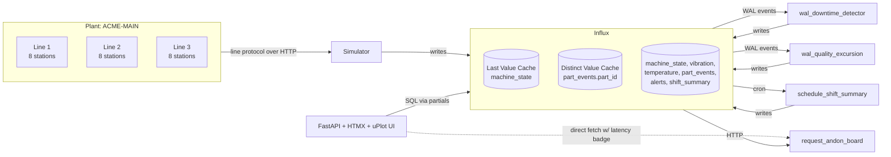

# IIoT Implementation Plan — `influxdb3-ref-iiot`

> **For agentic workers:** REQUIRED SUB-SKILL: Use superpowers:subagent-driven-development (recommended) or superpowers:executing-plans to implement this plan task-by-task. Steps use checkbox (`- [ ]`) syntax for tracking.

**Goal:** Ship a complete, runnable `influxdb3-ref-iiot` reference architecture that boots end-to-end with `make up` in under two minutes, demonstrates four Processing Engine plugins (two WAL, one schedule, one request) against an automotive-style assembly plant simulator (1 plant × 3 lines × 8 stations = 24 machines), and showcases InfluxDB 3 Enterprise (LVC, DVC, Processing Engine, custom UI calling the request trigger).

**Architecture:** Mirrors the bess pilot pattern: Python-first throughout (simulator, plugins, UI, tests, scripts), single-node compose stack (`influxdb3` + `simulator` + `ui` + `scenarios` services), FastAPI + HTMX + Jinja2 + uPlot UI, three-tier testing (unit / scenario / smoke), four GitHub Actions workflows, license-validated `influxdb-data` volume preserved across `make down`/`make up`. Repo and conventions inherited verbatim from the portfolio design.

**Tech Stack:** Python 3.12+, `influxdb3-python`, FastAPI, HTMX, Jinja2, uPlot (vendored JS), Docker / docker-compose, `testcontainers-python`, `pytest`, `ruff`, GitHub Actions.

**Spec:** [`influxdb3-ref-iiot/docs/superpowers/specs/2026-04-25-iiot-design.md`](https://github.com/influxdata/influxdb3-ref-iiot/blob/main/docs/superpowers/specs/2026-04-25-iiot-design.md) — read this before starting; this plan implements that design exactly.

**Reference repo (to copy patterns and assets from):** [`influxdb3-ref-bess`](https://github.com/influxdata/influxdb3-ref-bess) — local at `/Users/pauldix/codez/reference_architectures/influxdb3-ref-bess`.

---

## Phase 0 — API surface verification (READ BEFORE STARTING)

These are the gotchas that bit the bess pilot. Internalize them so you don't re-discover them by debugging.

### 0.1 Processing Engine plugin gotchas

- **`LineBuilder` is INJECTED, NOT IMPORTED.** The Processing Engine sets `LineBuilder` in the plugin module's globals before exec'ing the file. Do NOT do `from influxdb3_local import LineBuilder`. Do NOT do a `try: from … import LineBuilder; except ImportError: LineBuilder = None` fallback — that `None` shadows the engine's real injection at runtime and breaks the plugin silently. For unit tests, monkeypatch `LineBuilder` into the plugin module's namespace directly.
- **Cron strings are 6-FIELD**, not 5-field: `<sec> <min> <hour> <dom> <mon> <dow>`. So shift boundaries at 06:00:00, 14:00:00, 22:00:00 UTC are `cron:0 0 6,14,22 * * *`, not `cron:0 6,14,22 * * *`. Wrong field count fails silently or fires at the wrong time.
- **Plugin file naming convention** (auto-installed by `init.sh`): `wal_<name>.py` → WAL trigger; `schedule_<name>.py` → schedule trigger (binding cron in header); `request_<name>.py` → request trigger (binding path in header).
- **Plugin filenames register as the trigger NAME with the prefix stripped.** `request_andon_board.py` → trigger `andon_board` → endpoint `/api/v3/engine/andon_board`. Don't include the trigger type in the path.

### 0.2 InfluxDB 3 Enterprise environment

- **License validation on first boot.** The `influxdb:3-enterprise` container will not pass its `/health` healthcheck until the user clicks the validation link emailed to `INFLUXDB3_ENTERPRISE_EMAIL`. This blocks dependent services (`simulator`, `ui`) from starting via `depends_on: condition: service_healthy`. The `influxdb-data` named volume preserves validation across `make down`/`make up`; `make clean` drops it.
- **Disable license re-check via env var** for some commands by setting `INFLUXDB3_LICENSE_CHECK=false` if you need to run CLI commands quickly during dev — but the demo flow keeps validation on.
- **`INFLUXDB3_UNSET_VARS=LOG_FILTER`** must be set in compose (the engine reads `LOG_FILTER` from the host env if present and chokes on its own output format if it leaks in).

### 0.3 InfluxDB 3 SQL quirks

- **Time-window filters:** `WHERE time > now() - INTERVAL '1 hour'` works. Bare seconds (`now() - 3600`) does not. Always use `INTERVAL` literals.
- **`count(distinct …)`** works against the Distinct Value Cache when the cache is hinted via `WITH (use_cache='true')` in the query. Test both with and without to demonstrate the speedup in `CLI_EXAMPLES.md`.
- **Last Value Cache** is read implicitly: a SELECT with the cache key columns in WHERE picks it up automatically.

### 0.4 Simulator conventions

- **Test-time injection of `LineBuilder`-equivalent stubs**: simulator's `writer.py` writes line protocol over HTTP, so unit tests can use a `RecordingHTTPSession` that captures payloads.
- **`SIM_SEED` env var** must produce reproducible output for scenario tests. All `random.Random` instances in the simulator must be seeded from this single root.

### 0.5 Compose / build conventions

- **Plugin mount:** `./plugins:/var/lib/influxdb3/plugins:ro` on the `influxdb3` service.
- **`init.sh` runs as the `influxdb3` user inside the container**, after the server starts (via a wait-for-port loop) but before plugins/triggers are needed by the simulator.
- **`docker compose` (with a space)** not `docker-compose` (the v1 binary). Makefile uses `docker compose`.

### 0.6 Test isolation

- **Tier 1 (unit) tests must NOT require Docker.** Plugin tests use a fake `influxdb3_local` recording stub.
- **Tier 2 (scenario) tests require Docker** and skip with `pytest.skip("Docker not available")` if the daemon isn't reachable.
- **Tier 3 (smoke) test runs the actual `make up` flow** and requires a license-validated `influxdb-data` volume (refresh process documented in `FOR_MAINTAINERS.md`).

---

## File structure (what this plan produces)

After all tasks complete, the iiot repo contains:

```
influxdb3-ref-iiot/
├── README.md
├── ARCHITECTURE.md
├── SCENARIOS.md
├── CLI_EXAMPLES.md
├── FOR_MAINTAINERS.md
├── LICENSE
├── .env.example
├── .gitignore                (exists from spec commit; extended)
├── docker-compose.yml
├── Makefile
├── pyproject.toml
├── diagrams/
│   ├── architecture.mmd
│   └── architecture.png
├── influxdb/
│   ├── init.sh
│   └── schema.md
├── plugins/
│   ├── wal_downtime_detector.py
│   ├── wal_quality_excursion.py
│   ├── schedule_shift_summary.py
│   └── request_andon_board.py
├── simulator/
│   ├── Dockerfile
│   ├── __init__.py
│   ├── main.py
│   ├── config.py
│   ├── writer.py
│   ├── signals_base.py        (copied from bess)
│   ├── signals.py             (IIoT-specific)
│   └── scenarios/
│       ├── __init__.py
│       ├── unplanned_downtime_cascade.py
│       └── tool_wear_quality_drift.py
├── ui/
│   ├── Dockerfile
│   ├── __init__.py
│   ├── app.py
│   ├── queries.py
│   ├── templates/
│   │   ├── base.html
│   │   ├── overview.html
│   │   └── partials/
│   │       ├── _plant_state.html
│   │       ├── _kpi_row.html
│   │       ├── _andon_board.html
│   │       ├── _oee_breakdown.html
│   │       └── _alerts.html
│   └── static/
│       ├── app.css
│       ├── app.js
│       ├── htmx.min.js        (copied from bess)
│       ├── uplot.min.js       (copied from bess)
│       └── uplot.min.css      (copied from bess)
├── scripts/
│   ├── setup.sh
│   └── demo.sh
├── tests/
│   ├── __init__.py
│   ├── conftest.py
│   ├── test_signals.py
│   ├── test_writer.py
│   ├── test_queries.py
│   ├── test_smoke.py
│   ├── test_plugins/
│   │   ├── __init__.py
│   │   ├── test_wal_downtime_detector.py
│   │   ├── test_wal_quality_excursion.py
│   │   ├── test_schedule_shift_summary.py
│   │   └── test_request_andon_board.py
│   └── test_scenarios/
│       ├── __init__.py
│       ├── test_unplanned_downtime_cascade.py
│       └── test_tool_wear_quality_drift.py
├── .github/
│   └── workflows/
│       ├── unit.yml
│       ├── scenarios.yml
│       ├── smoke.yml
│       └── lint.yml
└── docs/
    └── superpowers/
        └── specs/
            └── 2026-04-25-iiot-design.md   (already committed)
```

Throughout this plan, the working directory is `/Users/pauldix/codez/reference_architectures/influxdb3-ref-iiot/` unless explicitly noted. The bess reference is at `/Users/pauldix/codez/reference_architectures/influxdb3-ref-bess/`.

---

## Phase 1 — Repo scaffolding

### Task 1: License, `.gitignore` extension, `.env.example`, `pyproject.toml`, README stub

**Files:**
- Create: `LICENSE` (copied from bess)
- Modify: `.gitignore`
- Create: `.env.example`
- Create: `pyproject.toml`
- Create: `README.md` (stub; polished in Task 32)

- [ ] **Step 1: Copy LICENSE from bess**

```bash
cp /Users/pauldix/codez/reference_architectures/influxdb3-ref-bess/LICENSE \
   /Users/pauldix/codez/reference_architectures/influxdb3-ref-iiot/LICENSE
```

Verify it's the Apache 2.0 text:

```bash
head -2 /Users/pauldix/codez/reference_architectures/influxdb3-ref-iiot/LICENSE
# Expected:
# Apache License
#                            Version 2.0, January 2004
```

- [ ] **Step 2: Extend `.gitignore`**

The spec commit already created `.gitignore`. Append CI/IDE artifacts:

```
.env
.venv/
__pycache__/
*.pyc
.pytest_cache/
.ruff_cache/
.DS_Store
node_modules/
*.egg-info/
dist/
build/
.coverage
htmlcov/
```

(Keep the existing entries; add only the new lines that aren't already there.)

- [ ] **Step 3: Create `.env.example`**

```bash
# Required for InfluxDB 3 Enterprise license validation.
# On first `make up`, a validation email is sent to this address; click the
# link in the email to activate your trial. The container will remain in
# "waiting for validation" state until you do.
INFLUXDB3_ENTERPRISE_EMAIL=

# Optional: license type. One of: home, trial, commercial. Default: trial.
# INFLUXDB3_ENTERPRISE_LICENSE_TYPE=trial

# Simulator tunables
SIM_RATE_HZ=1.0           # base tick rate; vibration is 10x this
SIM_SEED=42                # reproducibility for tests
SIM_LINES=3                # number of assembly lines
SIM_STATIONS_PER_LINE=8    # stations per line
SIM_NOMINAL_CYCLE_S=30.0   # ideal cycle time per machine

# UI
UI_PORT=8080
UI_KPI_POLL_MS=2000
UI_ANDON_POLL_MS=2000
UI_OEE_POLL_MS=5000
UI_ALERTS_POLL_MS=3000
```

- [ ] **Step 4: Create `pyproject.toml`**

Single project covering simulator, UI, and tests:

```toml
[build-system]
requires = ["setuptools>=68", "wheel"]
build-backend = "setuptools.build_meta"

[project]
name = "influxdb3-ref-iiot"
version = "0.1.0"
description = "Reference architecture: InfluxDB 3 Enterprise for IIoT / factory floor monitoring"
readme = "README.md"
license = { text = "Apache-2.0" }
requires-python = ">=3.12"
dependencies = [
  "influxdb3-python>=0.7",
  "fastapi>=0.110",
  "uvicorn[standard]>=0.27",
  "jinja2>=3.1",
  "httpx>=0.27",
  "python-dotenv>=1.0",
]

[project.optional-dependencies]
dev = [
  "pytest>=8.0",
  "pytest-asyncio>=0.23",
  "testcontainers>=4.0",
  "ruff>=0.4",
  "freezegun>=1.4",
]

[tool.setuptools.packages.find]
include = ["simulator*", "ui*"]

[tool.pytest.ini_options]
testpaths = ["tests"]
asyncio_mode = "auto"
markers = [
  "scenario: tier-2 scenario tests requiring Docker",
  "smoke: tier-3 smoke test running the full make up flow",
]

[tool.ruff]
line-length = 100
target-version = "py312"

[tool.ruff.lint]
select = ["E", "F", "I", "B", "UP", "SIM"]
```

- [ ] **Step 5: Create README stub**

```markdown
# influxdb3-ref-iiot

Reference architecture: **InfluxDB 3 Enterprise for IIoT / Factory Floor Monitoring**.

🚧 Under construction — see [`docs/superpowers/specs/2026-04-25-iiot-design.md`](docs/superpowers/specs/2026-04-25-iiot-design.md) for the design.

The polished README ships in Task 32 of the implementation plan.
```

- [ ] **Step 6: Commit**

```bash
cd /Users/pauldix/codez/reference_architectures/influxdb3-ref-iiot
git add LICENSE .gitignore .env.example pyproject.toml README.md
git commit -m "chore: scaffold license, env, pyproject, gitignore"
```

---

## Phase 2 — Simulator

The simulator runs as a long-lived service that writes line protocol to InfluxDB at a configurable rate. It implements the four IIoT signal classes (`MachineState`, `VibrationSensor`, `TemperatureSensor`, `PartCount`) per the spec §2.1.

### Task 2: Copy `signals_base.py` from bess and verify with tests

**Files:**
- Create: `simulator/__init__.py`
- Create: `simulator/signals_base.py` (copied verbatim from bess)
- Create: `tests/__init__.py`
- Create: `tests/test_signals_base.py`

The bess `signals_base.py` is intentionally self-contained and the same file ships in every reference repo. Copy it verbatim — do NOT modify it.

- [ ] **Step 1: Create the simulator package marker and copy signals_base**

```bash
mkdir -p /Users/pauldix/codez/reference_architectures/influxdb3-ref-iiot/simulator
mkdir -p /Users/pauldix/codez/reference_architectures/influxdb3-ref-iiot/tests
touch /Users/pauldix/codez/reference_architectures/influxdb3-ref-iiot/simulator/__init__.py
touch /Users/pauldix/codez/reference_architectures/influxdb3-ref-iiot/tests/__init__.py

cp /Users/pauldix/codez/reference_architectures/influxdb3-ref-bess/simulator/signals_base.py \
   /Users/pauldix/codez/reference_architectures/influxdb3-ref-iiot/simulator/signals_base.py
```

The file should contain `sinusoid`, `random_walk`, `step`, `burst`, `jitter` (no `correlation` — the portfolio spec mentioned it but bess didn't ship it; we follow the actual battle-tested file).

- [ ] **Step 2: Write tests for signals_base**

Create `tests/test_signals_base.py`:

```python
"""Tests for signal primitives. These are the same tests bess uses."""

from __future__ import annotations

import math

import pytest

from simulator.signals_base import burst, jitter, random_walk, sinusoid, step


def test_sinusoid_zero_phase_at_t_zero():
    # sin(0) = 0, so sinusoid(0, ...) = offset + 0 = offset
    assert sinusoid(0.0, period_s=10.0, amplitude=2.0, offset=5.0) == pytest.approx(5.0)


def test_sinusoid_quarter_period():
    # sin(π/2) = 1, so at t=period/4 → offset + amplitude
    assert sinusoid(2.5, period_s=10.0, amplitude=2.0, offset=5.0) == pytest.approx(7.0)


def test_random_walk_is_deterministic_given_seed():
    rw_a = random_walk(seed=42, step_std=1.0, start=0.0)
    rw_b = random_walk(seed=42, step_std=1.0, start=0.0)
    seq_a = [rw_a() for _ in range(100)]
    seq_b = [rw_b() for _ in range(100)]
    assert seq_a == seq_b


def test_random_walk_respects_bounds():
    rw = random_walk(seed=7, step_std=10.0, start=0.0, min_val=-1.0, max_val=1.0)
    for _ in range(1000):
        v = rw()
        assert -1.0 <= v <= 1.0


def test_step_function():
    s = step(at_t=10.0, before=0.0, after=100.0)
    assert s(0.0) == 0.0
    assert s(9.999) == 0.0
    assert s(10.0) == 100.0
    assert s(50.0) == 100.0


def test_burst_function():
    b = burst(at_t=5.0, duration_s=2.0, magnitude=3.0)
    assert b(4.999) == 0.0
    assert b(5.0) == 3.0
    assert b(6.999) == 3.0
    assert b(7.0) == 0.0


def test_jitter_is_deterministic_per_t():
    j = jitter(seed=11, std=1.0)
    assert j(1.0) == j(1.0)  # cached
    # different t → different value (almost certainly, with overwhelming probability)
    assert j(1.0) != j(2.0)
```

- [ ] **Step 3: Run tests — expect them to PASS (signals_base is verified-good code from bess)**

```bash
cd /Users/pauldix/codez/reference_architectures/influxdb3-ref-iiot
uv venv .venv && source .venv/bin/activate
uv pip install -e ".[dev]"
pytest tests/test_signals_base.py -v
```

Expected: 6 passed.

If they fail, do NOT modify `signals_base.py` — the file is canonical. Diagnose the test environment instead.

- [ ] **Step 4: Commit**

```bash
git add simulator/__init__.py simulator/signals_base.py tests/__init__.py tests/test_signals_base.py
git commit -m "feat(simulator): copy signal primitives library from bess"
```

### Task 3: IIoT domain signals (`signals.py`)

**Files:**
- Create: `simulator/signals.py`
- Create: `tests/test_signals.py`

This file implements the four IIoT signal classes plus a `Plant` aggregate. Each class produces line protocol when ticked.

- [ ] **Step 1: Write tests for IIoT signal classes**

Create `tests/test_signals.py`:

```python
"""Tests for IIoT domain signals."""

from __future__ import annotations

import pytest

from simulator.signals import (
    MachineState,
    PartCount,
    Plant,
    TemperatureSensor,
    VibrationSensor,
    build_plant,
)


def _parse_line(lp: str) -> tuple[str, dict[str, str], dict[str, str], int]:
    """Minimal line-protocol parser for test assertions.

    Returns (measurement, tags, fields, timestamp_ns).
    """
    measurement_and_tags, rest = lp.split(" ", 1)
    fields_and_ts = rest.rsplit(" ", 1)
    fields_str, ts_str = fields_and_ts[0], fields_and_ts[1]
    parts = measurement_and_tags.split(",")
    measurement = parts[0]
    tags = dict(p.split("=", 1) for p in parts[1:])
    fields = dict(p.split("=", 1) for p in fields_str.split(","))
    return measurement, tags, fields, int(ts_str)


def test_machine_state_emits_one_line_per_tick():
    m = MachineState(site="acme-main", line_id="L1", station_id="S1", machine_id="L1-S1")
    lines = m.tick(t_seconds=0.0, t_ns=1_000_000_000)
    assert len(lines) == 1
    measurement, tags, fields, ts = _parse_line(lines[0])
    assert measurement == "machine_state"
    assert tags["machine_id"] == "L1-S1"
    assert fields["state"] in (
        '"running"', '"idle"', '"stopped"', '"error"', '"changeover"', '"planned_maintenance"'
    )
    assert ts == 1_000_000_000


def test_machine_state_default_is_running():
    m = MachineState(site="acme-main", line_id="L1", station_id="S1", machine_id="L1-S1")
    lines = m.tick(t_seconds=0.0, t_ns=1_000_000_000)
    _, _, fields, _ = _parse_line(lines[0])
    assert fields["state"] == '"running"'


def test_machine_state_can_be_overridden():
    m = MachineState(site="acme-main", line_id="L1", station_id="S1", machine_id="L1-S1")
    m.set_state("stopped", reason="tool_change")
    lines = m.tick(t_seconds=0.0, t_ns=1_000_000_000)
    _, _, fields, _ = _parse_line(lines[0])
    assert fields["state"] == '"stopped"'
    assert fields["reason"] == '"tool_change"'


def test_temperature_sensor_emits_value_near_nominal():
    t = TemperatureSensor(
        site="acme-main", line_id="L1", station_id="S1", machine_id="L1-S1",
        nominal_c=65.0, seed=1,
    )
    samples = [float(_parse_line(t.tick(i, i * 1_000_000_000)[0])[2]["temp_c"]) for i in range(200)]
    avg = sum(samples) / len(samples)
    assert 60.0 <= avg <= 70.0  # drift bounded


def test_vibration_sensor_emits_10_lines_per_tick():
    v = VibrationSensor(
        site="acme-main", line_id="L1", station_id="S1", machine_id="L1-S1",
        nominal_mm_s=2.0, seed=1,
    )
    lines = v.tick(t_seconds=0.0, t_ns=1_000_000_000)
    assert len(lines) == 10  # 10 Hz
    for lp in lines:
        m, tags, fields, _ = _parse_line(lp)
        assert m == "vibration"
        assert "rms_mm_s" in fields


def test_vibration_sensor_responds_to_override():
    v = VibrationSensor(
        site="acme-main", line_id="L1", station_id="S1", machine_id="L1-S1",
        nominal_mm_s=2.0, seed=1,
    )
    v.set_target(4.5)  # tool wear scenario
    lines = v.tick(t_seconds=0.0, t_ns=1_000_000_000)
    avg = sum(float(_parse_line(lp)[2]["rms_mm_s"]) for lp in lines) / len(lines)
    # noise std is small; average should be close to target
    assert 4.0 <= avg <= 5.0


def test_part_count_emits_when_cycle_completes():
    pc = PartCount(
        site="acme-main", line_id="L1", station_id="S1", machine_id="L1-S1",
        ideal_cycle_time_s=2.0, seed=42,
    )
    # Tick once at t=0: starts a part, no line emitted
    assert pc.tick(t_seconds=0.0, t_ns=0) == []
    # Tick at t=2.0: cycle completes
    lines = pc.tick(t_seconds=2.0, t_ns=2_000_000_000)
    assert len(lines) == 1
    m, tags, fields, _ = _parse_line(lines[0])
    assert m == "part_events"
    assert "part_id" in tags
    assert tags["quality"] in ("good", "scrap")
    assert "cycle_time_s" in fields


def test_part_count_emits_no_parts_when_machine_stopped():
    pc = PartCount(
        site="acme-main", line_id="L1", station_id="S1", machine_id="L1-S1",
        ideal_cycle_time_s=2.0, seed=42,
    )
    pc.set_running(False)
    assert pc.tick(t_seconds=0.0, t_ns=0) == []
    assert pc.tick(t_seconds=10.0, t_ns=10_000_000_000) == []


def test_part_count_scrap_rate_default_is_low():
    pc = PartCount(
        site="acme-main", line_id="L1", station_id="S1", machine_id="L1-S1",
        ideal_cycle_time_s=1.0, seed=42,
    )
    qualities = []
    for i in range(2000):
        lines = pc.tick(t_seconds=i, t_ns=i * 1_000_000_000)
        for lp in lines:
            _, tags, _, _ = _parse_line(lp)
            qualities.append(tags["quality"])
    scrap_rate = qualities.count("scrap") / len(qualities)
    assert 0.0 < scrap_rate < 0.05  # nominal ~1%


def test_build_plant_creates_24_machines():
    plant = build_plant(site="acme-main", lines=3, stations_per_line=8, seed=42)
    assert len(plant.machines) == 24
    line_ids = {m.line_id for m in plant.machines}
    assert line_ids == {"L1", "L2", "L3"}
    assert all(len([m for m in plant.machines if m.line_id == lid]) == 8 for lid in line_ids)


def test_plant_tick_returns_lines_from_all_signals():
    plant = build_plant(site="acme-main", lines=3, stations_per_line=8, seed=42)
    lines = plant.tick(t_seconds=0.0, t_ns=0)
    # 24 machines × (1 state + 1 temp + 10 vibration) = 288 lines minimum
    # Part events are 0 at t=0 (cycles haven't completed yet)
    assert len(lines) == 24 * 12
```

- [ ] **Step 2: Run tests — expect them to FAIL (signals.py doesn't exist yet)**

```bash
pytest tests/test_signals.py -v
```

Expected: ImportError for `simulator.signals`.

- [ ] **Step 3: Implement `simulator/signals.py`**

```python
"""IIoT domain signal generators.

Each class takes (site, line_id, station_id, machine_id) plus class-specific
config and exposes a `tick(t_seconds, t_ns)` method returning a list of
line-protocol strings written for that tick. The Plant aggregate composes
24 machines (3 lines × 8 stations) and ticks them all in lockstep.

Signals support runtime overrides (e.g., `MachineState.set_state(...)`,
`VibrationSensor.set_target(...)`) so scenarios can inject events without
modifying the simulator main loop.
"""

from __future__ import annotations

import random
from dataclasses import dataclass, field
from typing import Literal

from simulator.signals_base import jitter, random_walk

State = Literal["running", "idle", "stopped", "error", "changeover", "planned_maintenance"]


def _esc(s: str) -> str:
    """Escape a tag/field-key string for line protocol (commas, spaces, equals)."""
    return s.replace(",", r"\,").replace(" ", r"\ ").replace("=", r"\=")


def _tag_block(tags: dict[str, str]) -> str:
    return ",".join(f"{_esc(k)}={_esc(v)}" for k, v in tags.items())


@dataclass
class MachineState:
    site: str
    line_id: str
    station_id: str
    machine_id: str
    _state: State = "running"
    _reason: str = ""

    def set_state(self, state: State, reason: str = "") -> None:
        self._state = state
        self._reason = reason

    def state(self) -> State:
        return self._state

    def tick(self, t_seconds: float, t_ns: int) -> list[str]:
        tags = _tag_block({
            "site": self.site,
            "line_id": self.line_id,
            "station_id": self.station_id,
            "machine_id": self.machine_id,
        })
        fields = f'state="{self._state}",reason="{self._reason}"'
        return [f"machine_state,{tags} {fields} {t_ns}"]


@dataclass
class TemperatureSensor:
    site: str
    line_id: str
    station_id: str
    machine_id: str
    nominal_c: float
    seed: int
    _walk: object = field(init=False)

    def __post_init__(self) -> None:
        self._walk = random_walk(
            seed=self.seed, step_std=0.2, start=self.nominal_c,
            min_val=self.nominal_c - 10.0, max_val=self.nominal_c + 20.0,
        )

    def tick(self, t_seconds: float, t_ns: int) -> list[str]:
        v = self._walk()
        tags = _tag_block({
            "site": self.site, "line_id": self.line_id,
            "station_id": self.station_id, "machine_id": self.machine_id,
        })
        return [f"temperature,{tags} temp_c={v:.3f} {t_ns}"]


@dataclass
class VibrationSensor:
    site: str
    line_id: str
    station_id: str
    machine_id: str
    nominal_mm_s: float
    seed: int
    _target: float = field(init=False)
    _noise: object = field(init=False)

    def __post_init__(self) -> None:
        self._target = self.nominal_mm_s
        self._noise = jitter(seed=self.seed, std=0.1)

    def set_target(self, target_mm_s: float) -> None:
        self._target = target_mm_s

    def target(self) -> float:
        return self._target

    def tick(self, t_seconds: float, t_ns: int) -> list[str]:
        # 10 Hz: emit 10 samples spread over the second
        out = []
        for i in range(10):
            ts = t_ns + int(i * 100_000_000)
            v = max(0.0, self._target + self._noise(t_seconds + i * 0.1))
            tags = _tag_block({
                "site": self.site, "line_id": self.line_id,
                "station_id": self.station_id, "machine_id": self.machine_id,
            })
            out.append(f"vibration,{tags} rms_mm_s={v:.3f} {ts}")
        return out


@dataclass
class PartCount:
    site: str
    line_id: str
    station_id: str
    machine_id: str
    ideal_cycle_time_s: float
    seed: int
    _running: bool = True
    _scrap_rate: float = 0.01
    _cycle_extension: float = 0.0  # added seconds per cycle (for tool-wear scenario)
    _cycle_start_t: float | None = None
    _seq: int = 0
    _rng: random.Random = field(init=False)

    def __post_init__(self) -> None:
        self._rng = random.Random(self.seed)

    def set_running(self, running: bool) -> None:
        self._running = running
        if not running:
            self._cycle_start_t = None

    def set_scrap_rate(self, rate: float) -> None:
        self._scrap_rate = max(0.0, min(1.0, rate))

    def set_cycle_extension(self, seconds: float) -> None:
        self._cycle_extension = max(0.0, seconds)

    def tick(self, t_seconds: float, t_ns: int) -> list[str]:
        if not self._running:
            return []
        if self._cycle_start_t is None:
            self._cycle_start_t = t_seconds
            return []
        elapsed = t_seconds - self._cycle_start_t
        target = self.ideal_cycle_time_s + self._cycle_extension
        if elapsed < target:
            return []
        # cycle complete
        self._seq += 1
        part_id = f"{self.machine_id}-{self._seq:08d}"
        quality = "scrap" if self._rng.random() < self._scrap_rate else "good"
        tags = _tag_block({
            "site": self.site, "line_id": self.line_id,
            "station_id": self.station_id, "machine_id": self.machine_id,
            "part_id": part_id, "quality": quality,
        })
        cycle_time = elapsed
        line = f"part_events,{tags} cycle_time_s={cycle_time:.3f} {t_ns}"
        self._cycle_start_t = t_seconds  # next cycle starts now
        return [line]


@dataclass
class Machine:
    site: str
    line_id: str
    station_id: str
    machine_id: str
    state: MachineState
    temperature: TemperatureSensor
    vibration: VibrationSensor
    parts: PartCount

    def tick(self, t_seconds: float, t_ns: int) -> list[str]:
        out: list[str] = []
        out.extend(self.state.tick(t_seconds, t_ns))
        out.extend(self.temperature.tick(t_seconds, t_ns))
        out.extend(self.vibration.tick(t_seconds, t_ns))
        # Part-count gates on running state
        if self.state.state() == "running":
            self.parts.set_running(True)
        else:
            self.parts.set_running(False)
        out.extend(self.parts.tick(t_seconds, t_ns))
        return out


@dataclass
class Plant:
    site: str
    machines: list[Machine]

    def tick(self, t_seconds: float, t_ns: int) -> list[str]:
        lines: list[str] = []
        for m in self.machines:
            lines.extend(m.tick(t_seconds, t_ns))
        return lines

    def find(self, machine_id: str) -> Machine:
        for m in self.machines:
            if m.machine_id == machine_id:
                return m
        raise KeyError(machine_id)


def build_plant(
    site: str, lines: int, stations_per_line: int, seed: int,
    nominal_cycle_s: float = 30.0,
) -> Plant:
    machines: list[Machine] = []
    for li in range(1, lines + 1):
        line_id = f"L{li}"
        for si in range(1, stations_per_line + 1):
            station_id = f"S{si}"
            mid = f"{line_id}-{station_id}"
            machine_seed = seed + li * 1000 + si
            machines.append(Machine(
                site=site, line_id=line_id, station_id=station_id, machine_id=mid,
                state=MachineState(site, line_id, station_id, mid),
                temperature=TemperatureSensor(
                    site, line_id, station_id, mid,
                    nominal_c=65.0, seed=machine_seed + 1,
                ),
                vibration=VibrationSensor(
                    site, line_id, station_id, mid,
                    nominal_mm_s=2.0, seed=machine_seed + 2,
                ),
                parts=PartCount(
                    site, line_id, station_id, mid,
                    ideal_cycle_time_s=nominal_cycle_s, seed=machine_seed + 3,
                ),
            ))
    return Plant(site=site, machines=machines)
```

- [ ] **Step 4: Run tests — expect them to PASS**

```bash
pytest tests/test_signals.py -v
```

Expected: 11 passed.

- [ ] **Step 5: Commit**

```bash
git add simulator/signals.py tests/test_signals.py
git commit -m "feat(simulator): IIoT domain signals (machine state, temp, vibration, parts)"
```

### Task 4: Writer, config, and simulator main loop

**Files:**
- Create: `simulator/config.py`
- Create: `simulator/writer.py`
- Create: `simulator/main.py`
- Create: `tests/test_writer.py`

- [ ] **Step 1: Write tests for the writer**

Create `tests/test_writer.py`:

```python
"""Tests for the line-protocol HTTP writer."""

from __future__ import annotations

from simulator.writer import InfluxDB3Writer


class _RecordingTransport:
    def __init__(self) -> None:
        self.payloads: list[str] = []

    def post(self, url: str, content: str, headers: dict[str, str]) -> None:
        self.payloads.append(content)


def test_writer_batches_lines_until_flush():
    t = _RecordingTransport()
    w = InfluxDB3Writer(
        url="http://x", database="iiot", token="t",
        batch_size=3, transport=t,
    )
    w.write("a,t=1 v=1 1")
    w.write("a,t=1 v=2 2")
    assert t.payloads == []  # not yet
    w.write("a,t=1 v=3 3")
    assert len(t.payloads) == 1
    assert "v=1" in t.payloads[0] and "v=3" in t.payloads[0]


def test_writer_flush_emits_remaining():
    t = _RecordingTransport()
    w = InfluxDB3Writer(
        url="http://x", database="iiot", token="t",
        batch_size=10, transport=t,
    )
    w.write("a,t=1 v=1 1")
    w.flush()
    assert len(t.payloads) == 1
    assert "v=1" in t.payloads[0]


def test_writer_flush_is_noop_when_empty():
    t = _RecordingTransport()
    w = InfluxDB3Writer(
        url="http://x", database="iiot", token="t",
        batch_size=10, transport=t,
    )
    w.flush()
    assert t.payloads == []
```

- [ ] **Step 2: Run tests — expect FAIL (no writer.py yet)**

```bash
pytest tests/test_writer.py -v
```

Expected: ImportError.

- [ ] **Step 3: Implement `simulator/writer.py`**

```python
"""HTTP line-protocol writer for InfluxDB 3.

Batches writes to reduce request count. The transport is injectable so unit
tests can capture payloads without a real HTTP roundtrip.
"""

from __future__ import annotations

from typing import Protocol

import httpx


class Transport(Protocol):
    def post(self, url: str, content: str, headers: dict[str, str]) -> None: ...


class _HttpxTransport:
    def __init__(self, timeout_s: float = 10.0) -> None:
        self._client = httpx.Client(timeout=timeout_s)

    def post(self, url: str, content: str, headers: dict[str, str]) -> None:
        r = self._client.post(url, content=content, headers=headers)
        r.raise_for_status()


class InfluxDB3Writer:
    def __init__(
        self,
        url: str,
        database: str,
        token: str,
        batch_size: int = 1000,
        transport: Transport | None = None,
    ) -> None:
        self._url = f"{url.rstrip('/')}/api/v3/write_lp?db={database}&precision=nanosecond"
        self._token = token
        self._batch_size = batch_size
        self._buf: list[str] = []
        self._transport: Transport = transport or _HttpxTransport()

    def write(self, line: str) -> None:
        self._buf.append(line)
        if len(self._buf) >= self._batch_size:
            self.flush()

    def flush(self) -> None:
        if not self._buf:
            return
        payload = "\n".join(self._buf)
        self._transport.post(
            self._url,
            content=payload,
            headers={
                "Authorization": f"Bearer {self._token}",
                "Content-Type": "text/plain; charset=utf-8",
            },
        )
        self._buf.clear()
```

- [ ] **Step 4: Run tests — expect PASS**

```bash
pytest tests/test_writer.py -v
```

Expected: 3 passed.

- [ ] **Step 5: Implement `simulator/config.py`**

The token is generated by the `token-bootstrap` compose service and written to a JSON file in the shared `influxdb-data` volume. The simulator mounts the volume read-only at `/tokens` and reads the JSON file. This mirrors the bess pattern exactly — read from `INFLUX_TOKEN_FILE` (a JSON file containing `{"token": "..."}`).

```python
"""Simulator configuration loaded from environment variables.

The InfluxDB admin token is generated inside the container by the
token-bootstrap compose service and persisted to a JSON file inside the
shared influxdb-data volume (mounted read-only at /tokens). We read that
file here. This mirrors the bess pattern.

All other defaults are appropriate for the demo; CI and scenarios override
what they need via env vars (notably SIM_SEED for reproducibility).
"""

from __future__ import annotations

import json
import os
from dataclasses import dataclass


@dataclass(frozen=True)
class Config:
    influxdb_url: str
    database: str
    token: str
    site: str
    rate_hz: float
    seed: int
    lines: int
    stations_per_line: int
    nominal_cycle_s: float
    duration_s: float | None  # None = run forever


def _load_token() -> str:
    # Direct env var takes precedence (used by tests and ad-hoc local runs).
    if "INFLUXDB3_TOKEN" in os.environ:
        return os.environ["INFLUXDB3_TOKEN"]
    path = os.environ.get("INFLUX_TOKEN_FILE", "/tokens/.iiot-operator-token")
    with open(path) as f:
        data = json.load(f)
    return data["token"]


def load() -> Config:
    return Config(
        influxdb_url=os.environ.get("INFLUX_URL", "http://influxdb3:8181"),
        database=os.environ.get("INFLUX_DB", "iiot"),
        token=_load_token(),
        site=os.environ.get("SIM_SITE", "acme-main"),
        rate_hz=float(os.environ.get("SIM_RATE_HZ", "1.0")),
        seed=int(os.environ.get("SIM_SEED", "42")),
        lines=int(os.environ.get("SIM_LINES", "3")),
        stations_per_line=int(os.environ.get("SIM_STATIONS_PER_LINE", "8")),
        nominal_cycle_s=float(os.environ.get("SIM_NOMINAL_CYCLE_S", "30.0")),
        duration_s=float(os.environ["SIM_DURATION_S"]) if "SIM_DURATION_S" in os.environ else None,
    )
```

Same env-var-first contract for tests: a test can set `INFLUXDB3_TOKEN=anything` to bypass the file read.

- [ ] **Step 6: Implement `simulator/main.py`**

```python
"""Simulator entry point. Runs forever (or for SIM_DURATION_S) writing to InfluxDB."""

from __future__ import annotations

import logging
import time

from simulator.config import load
from simulator.signals import build_plant
from simulator.writer import InfluxDB3Writer

logging.basicConfig(level=logging.INFO, format="%(asctime)s %(levelname)s %(message)s")
log = logging.getLogger("simulator")


def main() -> None:
    cfg = load()
    log.info("starting simulator: %s", cfg)
    writer = InfluxDB3Writer(url=cfg.influxdb_url, database=cfg.database, token=cfg.token)
    plant = build_plant(
        site=cfg.site, lines=cfg.lines,
        stations_per_line=cfg.stations_per_line, seed=cfg.seed,
        nominal_cycle_s=cfg.nominal_cycle_s,
    )
    period = 1.0 / cfg.rate_hz
    t0 = time.time()
    tick = 0
    try:
        while True:
            now = time.time()
            t_seconds = now - t0
            if cfg.duration_s is not None and t_seconds >= cfg.duration_s:
                break
            t_ns = int(now * 1_000_000_000)
            for line in plant.tick(t_seconds, t_ns):
                writer.write(line)
            tick += 1
            if tick % 30 == 0:
                writer.flush()
                log.info("tick=%d t=%.1fs lines_buffered=ok", tick, t_seconds)
            sleep_for = period - (time.time() - now)
            if sleep_for > 0:
                time.sleep(sleep_for)
    finally:
        writer.flush()
        log.info("simulator exiting after %d ticks", tick)


if __name__ == "__main__":
    main()
```

- [ ] **Step 7: Verify the full simulator package imports cleanly**

```bash
python -c "from simulator import signals, writer, config, main; print('ok')"
# Expected: ok
```

- [ ] **Step 8: Commit**

```bash
git add simulator/config.py simulator/writer.py simulator/main.py tests/test_writer.py
git commit -m "feat(simulator): writer, config, and main loop"
```

### Task 5: Simulator Dockerfile

**Files:**
- Create: `simulator/Dockerfile`

- [ ] **Step 1: Create the Dockerfile**

```dockerfile
FROM python:3.12-slim

WORKDIR /app

# Install just the runtime deps for the simulator (lighter than -e .[dev])
RUN pip install --no-cache-dir \
      "influxdb3-python>=0.7" \
      "httpx>=0.27"

COPY simulator /app/simulator
ENV PYTHONPATH=/app

CMD ["python", "-m", "simulator.main"]
```

- [ ] **Step 2: Build the image to verify Dockerfile syntax**

```bash
docker build -t iiot-simulator-check -f simulator/Dockerfile .
# Expected: build succeeds without errors
docker rmi iiot-simulator-check
```

- [ ] **Step 3: Commit**

```bash
git add simulator/Dockerfile
git commit -m "feat(simulator): Dockerfile"
```

---

## Phase 3 — InfluxDB, compose, Makefile

The compose stack mirrors bess: `token-bootstrap` (one-shot offline token generator), `influxdb3` (server with healthcheck), `influxdb3-init` (one-shot DB/cache/trigger creator that runs after the server is up), `simulator`, `ui`, `scenarios` (one-shot, profile-gated). Triggers are added to `init.sh` in Task 17, after the plugins themselves exist.

### Task 6: `influxdb/init.sh` — DB, caches, token bootstrap (triggers added in Task 17)

**Files:**
- Create: `influxdb/init.sh`
- Create: `influxdb/schema.md`

- [ ] **Step 1: Create `influxdb/init.sh`**

```bash
#!/usr/bin/env bash
# Runs inside the influxdb3 container on startup. Idempotent: safe to re-run.
# Creates the IIoT database, exposes the operator token (generated by the
# token-bootstrap service), creates last/distinct caches, and (in Task 17)
# registers the Processing Engine triggers.

set -euo pipefail

INFLUX_HOST="${INFLUX_HOST:-http://influxdb3:8181}"
INFLUX_DB="${INFLUX_DB:-iiot}"
TOKEN_FILE="/var/lib/influxdb3/.iiot-operator-token"

log() { echo "[init] $*"; }

wait_for_api() {
    local url="${INFLUX_HOST}/health"
    for _ in $(seq 1 120); do
        if curl -s --max-time 2 -o /dev/null "$url"; then return 0; fi
        sleep 1
    done
    echo "[init] FATAL: influxdb3 API did not become ready" >&2
    exit 1
}

read_token_json() {
    sed -n 's/.*"token"[[:space:]]*:[[:space:]]*"\([^"]*\)".*/\1/p' "$1" | head -n1
}

ensure_token() {
    if [[ ! -s "${TOKEN_FILE}" ]]; then
        echo "[init] FATAL: ${TOKEN_FILE} missing — token-bootstrap service failed" >&2
        exit 1
    fi
    local plain="/var/lib/influxdb3/.iiot-token-plain"
    if [[ ! -s "${plain}" ]]; then
        read_token_json "${TOKEN_FILE}" > "${plain}"
        chmod 600 "${plain}"
    fi
    log "admin token present (generated by token-bootstrap)"
}

cli() {
    local token
    token=$(read_token_json "${TOKEN_FILE}")
    influxdb3 "$@" --host "${INFLUX_HOST}" --token "${token}"
}

idempotent() {
    local label="$1"; shift
    local out
    if out=$(cli "$@" 2>&1); then
        log "created ${label}"
    elif echo "$out" | grep -qE "already exists|Conflict|409"; then
        log "${label} already exists"
    else
        echo "[init] FATAL while creating ${label}: $out" >&2
        exit 1
    fi
}

ensure_database() {
    idempotent "database ${INFLUX_DB}" create database "${INFLUX_DB}"
}

# Caches and several UI queries reference tables by name and require them
# to EXIST at query/create time. Seed each user table with one sentinel row
# at timestamp 1 ns (1970-01-01 — outside every recent-time window the UI
# queries) using tag sets the simulator/plugins never emit.
ensure_seed_tables() {
    local token
    token=$(read_token_json "${TOKEN_FILE}")
    local seeds=(
        'machine_state,site=__init,line_id=__init,station_id=__init,machine_id=__init state="__init",reason="__init" 1'
        'temperature,site=__init,line_id=__init,station_id=__init,machine_id=__init temp_c=0 1'
        'vibration,site=__init,line_id=__init,station_id=__init,machine_id=__init rms_mm_s=0 1'
        'part_events,site=__init,line_id=__init,station_id=__init,machine_id=__init,part_id=__init,quality=__init cycle_time_s=0 1'
        'alerts,source=__init,severity=__init,line_id=__init,machine_id=__init reason="__init",value=0 1'
        'shift_summary,line_id=__init,shift_id=__init oee=0,availability=0,performance=0,quality=0,units_total=0,units_good=0,downtime_top1_reason="__init",downtime_top2_reason="__init",downtime_top3_reason="__init",downtime_top1_seconds=0,downtime_top2_seconds=0,downtime_top3_seconds=0 1'
    )
    local body
    body=$(printf '%s\n' "${seeds[@]}")
    if curl -sf -X POST \
            "${INFLUX_HOST}/api/v3/write_lp?db=${INFLUX_DB}&precision=nanosecond" \
            -H "Authorization: Bearer ${token}" \
            -H "Content-Type: text/plain" \
            --data "${body}" >/dev/null 2>&1; then
        log "seeded all user tables"
    else
        log "sentinel writes may have failed (table-already-exists is fine); continuing"
    fi
}

ensure_caches() {
    idempotent "last_cache machine_state_last" create last_cache machine_state_last \
        --database "${INFLUX_DB}" --table machine_state
    idempotent "distinct_cache part_id_distinct" create distinct_cache part_id_distinct \
        --database "${INFLUX_DB}" --table part_events --columns part_id
}

ensure_triggers() {
    # Filled in in Task 17 after plugin files exist. Stubbed here so the
    # function is callable; main() invokes it.
    log "no triggers yet (added in Task 17)"
}

main() {
    wait_for_api
    ensure_token
    ensure_database
    ensure_seed_tables
    ensure_caches
    ensure_triggers
    log "initialization complete"
}

main "$@"
```

- [ ] **Step 2: `chmod +x` and verify shellcheck cleanliness**

```bash
chmod +x /Users/pauldix/codez/reference_architectures/influxdb3-ref-iiot/influxdb/init.sh
# If shellcheck is installed, run it:
shellcheck /Users/pauldix/codez/reference_architectures/influxdb3-ref-iiot/influxdb/init.sh || true
```

- [ ] **Step 3: Create `influxdb/schema.md` (descriptive doc)**

```markdown
# IIoT schema

This file documents the IIoT demo's InfluxDB 3 schema. It is descriptive — the actual
tables are created implicitly by the first write. The `init.sh` script creates the
database, an operator token, the Last/Distinct caches, and registers Processing Engine
triggers.

## Tables

| Table | Tags | Fields | Source |
|-------|------|--------|--------|
| `machine_state` | site, line_id, station_id, machine_id | state (string), reason (string) | simulator (1 Hz per machine) |
| `temperature` | site, line_id, station_id, machine_id | temp_c (f64) | simulator (1 Hz per machine) |
| `vibration` | site, line_id, station_id, machine_id | rms_mm_s (f64) | simulator (10 Hz per machine) |
| `part_events` | site, line_id, station_id, machine_id, part_id, quality | cycle_time_s (f64) | simulator (event-driven) |
| `alerts` | source, severity, line_id, machine_id | reason (string), value (f64) | plugins (`wal_downtime_detector`, `wal_quality_excursion`) |
| `shift_summary` | line_id, shift_id | oee, availability, performance, quality, units_total, units_good (f64), downtime_top1_reason, downtime_top2_reason, downtime_top3_reason (string), downtime_top1_seconds, downtime_top2_seconds, downtime_top3_seconds (f64) | plugin (`schedule_shift_summary`) |

## Caches

- **Last Value Cache** `machine_state_last` on `machine_state` keyed by (site, line_id, station_id, machine_id) — 24-row in-memory cache that powers the plant-state banner and is read by `request_andon_board` to assemble the andon JSON. Sub-millisecond per-machine lookup.
- **Distinct Value Cache** `part_id_distinct` on `part_events.part_id` — accelerates the "distinct parts today" KPI. Demonstrated explicitly in `cache-distinct` CLI example.

## Retention

No retention policy in the demo. The simulator writes at ~300 pts/s and we want
readers to see accumulated history for the per-line OEE charts. For production,
see `ARCHITECTURE.md` § "Scaling to production".
```

- [ ] **Step 4: Commit**

```bash
git add influxdb/init.sh influxdb/schema.md
git commit -m "feat(influxdb): init.sh (DB, token, seeds, caches) + schema doc"
```

### Task 7: `docker-compose.yml`

**Files:**
- Create: `docker-compose.yml`

- [ ] **Step 1: Create `docker-compose.yml`**

```yaml
name: influxdb3-ref-iiot

services:
  # One-shot: generate an offline admin token on first boot. The server
  # needs one via --admin-token-file; the recovery endpoint can only
  # REGENERATE existing tokens, not create the first one.
  token-bootstrap:
    image: influxdb:3-enterprise
    container_name: iiot-token-bootstrap
    environment:
      INFLUXDB3_UNSET_VARS: LOG_FILTER
      INFLUXDB3_LOG_FILTER: info
    volumes:
      - influxdb-data:/var/lib/influxdb3
    entrypoint: ["sh", "-c"]
    command:
      - |
        if [ -s /var/lib/influxdb3/.iiot-operator-token ]; then
          echo "[bootstrap] admin token already exists, skipping"
          exit 0
        fi
        echo "[bootstrap] generating offline admin token"
        influxdb3 create token --admin --offline \
          --name iiot-admin \
          --output-file /var/lib/influxdb3/.iiot-operator-token
        chmod 600 /var/lib/influxdb3/.iiot-operator-token
        echo "[bootstrap] admin token written"
    restart: "no"

  influxdb3:
    image: influxdb:3-enterprise
    container_name: iiot-influxdb3
    depends_on:
      token-bootstrap:
        condition: service_completed_successfully
    environment:
      INFLUXDB3_ENTERPRISE_LICENSE_EMAIL: ${INFLUXDB3_ENTERPRISE_EMAIL:?set INFLUXDB3_ENTERPRISE_EMAIL in .env}
      INFLUXDB3_ENTERPRISE_LICENSE_TYPE: ${INFLUXDB3_ENTERPRISE_LICENSE_TYPE:-trial}
      INFLUXDB3_PLUGIN_DIR: /plugins
      INFLUXDB3_NODE_IDENTIFIER_PREFIX: iiot-node
      INFLUXDB3_OBJECT_STORE: file
      INFLUXDB3_DATA_DIR: /var/lib/influxdb3
      INFLUXDB3_UNSET_VARS: LOG_FILTER
      INFLUXDB3_LOG_FILTER: info
    command: >
      serve
        --node-id iiot-node0
        --cluster-id iiot
        --mode all
        --object-store file
        --data-dir /var/lib/influxdb3
        --plugin-dir /plugins
        --virtual-env-location /var/lib/influxdb3/plugin-venv
        --admin-token-file /var/lib/influxdb3/.iiot-operator-token
        --admin-token-recovery-http-bind 0.0.0.0:8182
    volumes:
      - influxdb-data:/var/lib/influxdb3
      - ./plugins:/plugins:ro
      - ./influxdb/init.sh:/usr/local/bin/iiot-init.sh:ro
    ports:
      - "8181:8181"
    healthcheck:
      test: ["CMD-SHELL", "curl -s --max-time 2 -o /dev/null http://127.0.0.1:8181/health && test -s /var/lib/influxdb3/.iiot-operator-token"]
      interval: 5s
      timeout: 3s
      retries: 120
      start_period: 5s

  influxdb3-init:
    image: influxdb:3-enterprise
    container_name: iiot-influxdb3-init
    depends_on:
      influxdb3:
        condition: service_started
    environment:
      INFLUXDB3_UNSET_VARS: LOG_FILTER
      INFLUXDB3_LOG_FILTER: info
    volumes:
      - influxdb-data:/var/lib/influxdb3
      - ./influxdb/init.sh:/usr/local/bin/iiot-init.sh:ro
      - ./plugins:/plugins:ro
    entrypoint: ["/usr/local/bin/iiot-init.sh"]
    restart: "no"

  simulator:
    build:
      context: .
      dockerfile: simulator/Dockerfile
    container_name: iiot-simulator
    depends_on:
      influxdb3:
        condition: service_healthy
      influxdb3-init:
        condition: service_completed_successfully
    environment:
      INFLUX_URL: http://influxdb3:8181
      INFLUX_DB: iiot
      INFLUX_TOKEN_FILE: /tokens/.iiot-operator-token
      SIM_RATE_HZ: ${SIM_RATE_HZ:-1.0}
      SIM_SEED: ${SIM_SEED:-42}
      SIM_LINES: ${SIM_LINES:-3}
      SIM_STATIONS_PER_LINE: ${SIM_STATIONS_PER_LINE:-8}
      SIM_NOMINAL_CYCLE_S: ${SIM_NOMINAL_CYCLE_S:-30.0}
    command: ["python", "-m", "simulator.main"]
    volumes:
      - influxdb-data:/tokens:ro

  ui:
    build:
      context: .
      dockerfile: ui/Dockerfile
    container_name: iiot-ui
    depends_on:
      influxdb3:
        condition: service_healthy
      influxdb3-init:
        condition: service_completed_successfully
    environment:
      INFLUX_URL: http://influxdb3:8181
      INFLUX_DB: iiot
      INFLUX_TOKEN_FILE: /tokens/.iiot-operator-token
      UI_KPI_POLL_MS: ${UI_KPI_POLL_MS:-2000}
      UI_ANDON_POLL_MS: ${UI_ANDON_POLL_MS:-2000}
      UI_OEE_POLL_MS: ${UI_OEE_POLL_MS:-5000}
      UI_ALERTS_POLL_MS: ${UI_ALERTS_POLL_MS:-3000}
    command: ["uvicorn", "ui.app:app", "--host", "0.0.0.0", "--port", "8080"]
    ports:
      - "8080:8080"
    volumes:
      - influxdb-data:/tokens:ro

  scenarios:
    build:
      context: .
      dockerfile: simulator/Dockerfile
    container_name: iiot-scenarios
    profiles: ["scenarios"]
    depends_on:
      influxdb3:
        condition: service_healthy
      influxdb3-init:
        condition: service_completed_successfully
    environment:
      INFLUX_URL: http://influxdb3:8181
      INFLUX_DB: iiot
      INFLUX_TOKEN_FILE: /tokens/.iiot-operator-token
      SCENARIO: ${SCENARIO:-}
    volumes:
      - influxdb-data:/tokens:ro
    entrypoint: ["sh", "-c", "test -n \"$$SCENARIO\" || { echo 'SCENARIO env var not set' >&2; exit 2; }; exec python -m simulator.scenarios.$$SCENARIO"]
    restart: "no"

volumes:
  influxdb-data:
```

- [ ] **Step 2: Validate compose file syntax**

```bash
cd /Users/pauldix/codez/reference_architectures/influxdb3-ref-iiot
docker compose config > /dev/null
# Expected: no output, exit 0
```

If you see "INFLUXDB3_ENTERPRISE_EMAIL" required, that's expected — `docker compose config` requires the var. Set `INFLUXDB3_ENTERPRISE_EMAIL=test@example.com docker compose config` for the syntax check.

- [ ] **Step 3: Commit**

```bash
git add docker-compose.yml
git commit -m "feat: docker-compose stack (token-bootstrap + influxdb3 + init + simulator + ui + scenarios)"
```

### Task 8: Setup script and Makefile

**Files:**
- Create: `scripts/setup.sh`
- Create: `Makefile`

- [ ] **Step 1: Create `scripts/setup.sh`**

```bash
#!/usr/bin/env bash
# Prompts for INFLUXDB3_ENTERPRISE_EMAIL if not yet set in .env.
# Creates .env from .env.example if missing. Idempotent.

set -euo pipefail

cd "$(dirname "$0")/.."

if [[ ! -f .env ]]; then
    cp .env.example .env
    echo "[setup] created .env from .env.example"
fi

if grep -q '^INFLUXDB3_ENTERPRISE_EMAIL=.\+' .env; then
    EMAIL=$(grep '^INFLUXDB3_ENTERPRISE_EMAIL=' .env | cut -d= -f2-)
    echo "[setup] using existing INFLUXDB3_ENTERPRISE_EMAIL=${EMAIL}"
    exit 0
fi

echo
echo "InfluxDB 3 Enterprise requires email-based license validation."
echo "On first startup, a validation email is sent to the address below."
echo "You must click the validation link before the stack finishes starting."
echo
read -rp "Enter email for license validation: " EMAIL

if [[ -z "${EMAIL}" ]]; then
    echo "[setup] empty email; aborting" >&2
    exit 1
fi

if grep -q '^INFLUXDB3_ENTERPRISE_EMAIL=' .env; then
    python3 - "$EMAIL" <<'PY'
import pathlib, re, sys
email = sys.argv[1]
p = pathlib.Path(".env")
p.write_text(re.sub(r'^INFLUXDB3_ENTERPRISE_EMAIL=.*$',
                    f'INFLUXDB3_ENTERPRISE_EMAIL={email}',
                    p.read_text(), flags=re.M))
PY
else
    echo "INFLUXDB3_ENTERPRISE_EMAIL=${EMAIL}" >> .env
fi

echo "[setup] wrote INFLUXDB3_ENTERPRISE_EMAIL=${EMAIL} to .env"
```

- [ ] **Step 2: `chmod +x` setup.sh**

```bash
chmod +x /Users/pauldix/codez/reference_architectures/influxdb3-ref-iiot/scripts/setup.sh
```

- [ ] **Step 3: Create `Makefile`**

```makefile
SHELL := /usr/bin/env bash
.DEFAULT_GOAL := help
COMPOSE := docker compose

.PHONY: help up down clean demo demo-fresh cli cli-example query logs ps \
        scenario scenario-list test test-unit test-scenarios test-smoke \
        lint format

help: ## Show targets
	@awk 'BEGIN{FS=":.*##"} /^[a-zA-Z0-9_-]+:.*##/ {printf "  \033[1;36m%-20s\033[0m %s\n",$$1,$$2}' $(MAKEFILE_LIST)

demo: ## End-to-end scripted demo: stack up → browser → scenarios → results
	@./scripts/demo.sh

demo-fresh: ## Same as demo, but wipes state first (forces license re-validation)
	@./scripts/demo.sh --fresh

up: ## Prompt for email (if needed), write .env, then bring the stack up
	@./scripts/setup.sh
	@echo
	@echo "============================================================="
	@echo "  InfluxDB 3 Enterprise is starting."
	@echo "  Check the email you provided and CLICK THE VALIDATION LINK."
	@echo "  The simulator and UI will start automatically once validation"
	@echo "  completes. UI: http://localhost:8080   API: http://localhost:8181"
	@echo "============================================================="
	@$(COMPOSE) up -d

down: ## Stop services (preserves data volume)
	@$(COMPOSE) down

clean: ## Stop services and drop the data volume (requires re-validation next time)
	@$(COMPOSE) down -v

logs: ## Tail all service logs
	@$(COMPOSE) logs -f

ps: ## Show service status
	@$(COMPOSE) ps

cli: ## Shell into influxdb3 container; TOKEN is exported, `iql <sql>` runs queries
	@$(COMPOSE) exec influxdb3 bash -c '\
	  export TOKEN=$$(cat /var/lib/influxdb3/.iiot-token-plain); \
	  iql() { influxdb3 query --database iiot --token "$$TOKEN" "$$1"; }; \
	  export -f iql; \
	  echo ""; \
	  echo "  TOKEN is exported. Try:"; \
	  echo "    iql \"SELECT COUNT(*) FROM machine_state\""; \
	  echo "    iql \"SELECT * FROM machine_state ORDER BY time DESC LIMIT 5\""; \
	  echo ""; \
	  exec bash'

query: ## One-shot query. Usage: make query sql='SELECT COUNT(*) FROM machine_state'
	@test -n "$(sql)" || (echo "usage: make query sql='<SQL>'"; exit 1)
	@$(COMPOSE) exec -T -e "SQL=$(sql)" influxdb3 bash -c 'TOKEN=$$(cat /var/lib/influxdb3/.iiot-token-plain); influxdb3 query --database iiot --token "$$TOKEN" "$$SQL"'

cli-example: ## Run a named curated CLI example. Usage: make cli-example name=list-databases
	@test -n "$(name)" || (echo "usage: make cli-example name=<example>"; exit 1)
	@grep -A 20 "^## $(name)" CLI_EXAMPLES.md | sed -n '/^```bash/,/^```/p' | sed '1d;$$d' \
	  | while read -r line; do echo "+ $$line"; $(COMPOSE) exec -T influxdb3 bash -lc "export TOKEN=\$$(cat /var/lib/influxdb3/.iiot-token-plain); $$line"; done

scenario: ## Run a scenario. Usage: make scenario name=unplanned_downtime_cascade
	@test -n "$(name)" || (echo "usage: make scenario name=<scenario>"; exit 1)
	@SCENARIO=$(name) $(COMPOSE) --profile scenarios run --rm scenarios

scenario-list: ## List available scenarios
	@ls simulator/scenarios/*.py 2>/dev/null | grep -v __init__ | xargs -I{} basename {} .py | while read n; do \
	  desc=$$(grep -m1 '^"""' simulator/scenarios/$$n.py | sed 's/"""//g'); \
	  printf "  %-32s %s\n" "$$n" "$$desc"; done

test: test-unit test-scenarios ## Run unit + scenario tests (skip smoke)

test-unit: ## Plugin + signal + query unit tests (no docker)
	@pytest tests -q -m "not scenario and not smoke"

test-scenarios: ## Scenario integration tests (uses testcontainers)
	@pytest tests/test_scenarios -q -m scenario

test-smoke: ## End-to-end smoke via docker compose (slow)
	@pytest tests/test_smoke.py -q -m smoke

lint: ## Check formatting and lint
	@ruff check .
	@ruff format --check .

format: ## Auto-fix formatting
	@ruff check --fix .
	@ruff format .
```

- [ ] **Step 4: Verify `make help` works**

```bash
cd /Users/pauldix/codez/reference_architectures/influxdb3-ref-iiot
make help
# Expected: colorized list of targets with descriptions
```

- [ ] **Step 5: Commit**

```bash
git add scripts/setup.sh Makefile
git commit -m "feat: setup script and Makefile"
```

---

## Phase 4 — Manual validation checkpoint #1 (no automated test — human verifies)

### Task 9: First manual end-to-end smoke test (simulator only, no plugins/UI yet)

**Goal:** prove the simulator + InfluxDB + init.sh stack boots, produces data, and can be queried — before adding plugins or UI on top.

- [ ] **Step 1: Set the email and bring the stack up**

```bash
cd /Users/pauldix/codez/reference_architectures/influxdb3-ref-iiot
make up
```

Click the validation link emailed to `INFLUXDB3_ENTERPRISE_EMAIL`. Wait until `make ps` shows `influxdb3` as `healthy`.

- [ ] **Step 2: Verify initialization completed**

```bash
docker compose logs influxdb3-init | tail -20
# Expected lines:
# [init] admin token present (generated by token-bootstrap)
# [init] created database iiot   (or "already exists")
# [init] seeded all user tables  (or warning that's OK)
# [init] created last_cache machine_state_last
# [init] created distinct_cache part_id_distinct
# [init] no triggers yet (added in Task 17)
# [init] initialization complete
```

- [ ] **Step 3: Verify simulator is writing**

```bash
docker compose logs simulator | tail -10
# Expected: "tick=N t=Ns lines_buffered=ok" lines, increasing tick number.

make query sql='SELECT COUNT(*) FROM machine_state WHERE time > now() - INTERVAL '"'"'1 minute'"'"
# Expected: a count > 0 (24 machines × ticks-per-minute)

make query sql='SELECT DISTINCT machine_id FROM machine_state WHERE time > now() - INTERVAL '"'"'1 minute'"'"
# Expected: 24 distinct machine_ids (L1-S1 through L3-S8)

make query sql='SELECT COUNT(*) FROM part_events WHERE time > now() - INTERVAL '"'"'2 minutes'"'"
# Expected: a count > 0 (cycles begin completing after ~30s of running)

make query sql='SELECT * FROM vibration WHERE time > now() - INTERVAL '"'"'5 seconds'"'"' LIMIT 5'
# Expected: 5 rows with rms_mm_s near 2.0
```

- [ ] **Step 4: Verify Last Value Cache works**

```bash
make query sql='SELECT * FROM machine_state WHERE site = '"'"'acme-main'"'"
# Expected: 24 rows, one per machine, all state="running" (the LVC is hit
# automatically when the WHERE clause matches the cache key)
```

- [ ] **Step 5: Tear down without losing the validated license**

```bash
make down
make up   # should not require re-validation
```

If validation IS re-prompted, the volume was lost. Fix and re-validate before continuing.

- [ ] **Step 6: Note observations**

Capture any surprises in a scratch file (e.g., `notes/checkpoint1.md`). Don't commit yet — these notes are for the implementer's reference. If you find a bug in init.sh or compose, fix it now and re-test before moving on.

---

## Phase 5 — Scenarios

Scenarios are runnable Python scripts under `simulator/scenarios/` that connect to the running stack and inject specific event patterns. They make plugins demonstrable.

### Task 10: Scenario framework helper

**Files:**
- Create: `simulator/scenarios/__init__.py`
- Create: `simulator/scenarios/_base.py` (helpers shared between scenarios)

- [ ] **Step 1: Create `simulator/scenarios/__init__.py`**

```bash
touch /Users/pauldix/codez/reference_architectures/influxdb3-ref-iiot/simulator/scenarios/__init__.py
```

- [ ] **Step 2: Create `simulator/scenarios/_base.py`**

```python
"""Shared helpers for scenario scripts.

Each scenario:
  1. Opens an InfluxDB3Writer connected to the running stack.
  2. Writes line protocol directly (no signals.py instances) to inject
     a specific event pattern.
  3. Prints step-by-step so readers can follow along.
"""

from __future__ import annotations

import sys
import time

from simulator.config import load
from simulator.writer import InfluxDB3Writer


def open_writer() -> InfluxDB3Writer:
    cfg = load()
    return InfluxDB3Writer(
        url=cfg.influxdb_url, database=cfg.database, token=cfg.token, batch_size=200,
    )


def announce(step_no: int, message: str) -> None:
    print(f"[scenario step {step_no}] {message}", flush=True)


def fail(message: str) -> None:
    print(f"[scenario] FAIL: {message}", file=sys.stderr, flush=True)
    sys.exit(1)


def now_ns() -> int:
    return int(time.time() * 1_000_000_000)


def sleep(seconds: float) -> None:
    time.sleep(seconds)
```

- [ ] **Step 3: Commit**

```bash
git add simulator/scenarios/__init__.py simulator/scenarios/_base.py
git commit -m "feat(scenarios): shared scenario helpers"
```

### Task 11: `unplanned_downtime_cascade` scenario

**Files:**
- Create: `simulator/scenarios/unplanned_downtime_cascade.py`

This scenario writes the `machine_state` rows that simulate L2-S4 stopping and the cascade. It does NOT modify the simulator's running plant — it writes alongside it. Both write streams land in InfluxDB; the WAL plugin (in Phase 6) will fire on the scenario writes.

- [ ] **Step 1: Implement the scenario**

```python
"""A station on Line 2 stops; upstream starves, downstream blocks, line OEE plummets.

Writes machine_state rows that flip L2-S4 to stopped, then propagate idle states
to other Line 2 stations. The WAL trigger wal_downtime_detector (registered by
init.sh) fires within ~1s of the L2-S4 state change and writes a row to alerts.

Run via: make scenario name=unplanned_downtime_cascade
"""

from __future__ import annotations

from simulator.scenarios._base import announce, now_ns, open_writer, sleep

LINE = "L2"
DOWNED_STATION = "S4"
SITE = "acme-main"


def _state_line(station: str, state: str, reason: str = "") -> str:
    machine_id = f"{LINE}-{station}"
    return (
        f'machine_state,site={SITE},line_id={LINE},'
        f'station_id={station},machine_id={machine_id} '
        f'state="{state}",reason="{reason}" {now_ns()}'
    )


def main() -> None:
    writer = open_writer()
    try:
        announce(1, "baseline: 10s of nominal operation (no scenario writes)")
        sleep(10)

        announce(2, f"{LINE}-{DOWNED_STATION} → stopped (reason=tool_change)")
        writer.write(_state_line(DOWNED_STATION, "stopped", "tool_change"))
        writer.flush()

        announce(3, "propagating idle to upstream/downstream over 5s")
        sleep(5)
        for s in ("S1", "S2", "S3"):  # upstream starves
            writer.write(_state_line(s, "idle", "starved"))
        for s in ("S5", "S6", "S7", "S8"):  # downstream blocked
            writer.write(_state_line(s, "idle", "blocked"))
        writer.flush()

        announce(4, "holding stopped state for 60s (alert should fire by now)")
        # Re-emit the stopped state every 5s so the WAL trigger sees fresh writes.
        for _ in range(12):
            writer.write(_state_line(DOWNED_STATION, "stopped", "tool_change"))
            writer.flush()
            sleep(5)

        announce(5, "recovery: all Line 2 stations back to running")
        for s in ("S1", "S2", "S3", "S4", "S5", "S6", "S7", "S8"):
            writer.write(_state_line(s, "running"))
        writer.flush()

        announce(6, "DONE — verify: SELECT * FROM alerts WHERE line_id='L2' ORDER BY time DESC LIMIT 5")
    finally:
        writer.flush()


if __name__ == "__main__":
    main()
```

- [ ] **Step 2: Smoke-test the scenario file imports cleanly**

```bash
cd /Users/pauldix/codez/reference_architectures/influxdb3-ref-iiot
python -c "from simulator.scenarios import unplanned_downtime_cascade; print('ok')"
# Expected: ok
```

(Cannot run end-to-end yet — the WAL plugin doesn't exist. Tier-2 test in Phase 9.)

- [ ] **Step 3: Commit**

```bash
git add simulator/scenarios/unplanned_downtime_cascade.py
git commit -m "feat(scenarios): unplanned_downtime_cascade"
```

### Task 12: `tool_wear_quality_drift` scenario

**Files:**
- Create: `simulator/scenarios/tool_wear_quality_drift.py`

- [ ] **Step 1: Implement the scenario**

```python
"""Vibration on Line 1 Station 6 trends up over 5 min; cycle time slows, scrap rate rises, quality alert fires.

Writes vibration rows ramping from 2.0 → 4.5 mm/s and part_events rows whose
quality flips to scrap at 15% rate once vibration exceeds 3.5 mm/s. The WAL
trigger wal_quality_excursion (registered by init.sh) fires when the windowed
scrap rate crosses the configured threshold (default 0.10 over 20-event window).

Run via: make scenario name=tool_wear_quality_drift
"""

from __future__ import annotations

import random

from simulator.scenarios._base import announce, now_ns, open_writer, sleep

LINE = "L1"
TARGET_STATION = "S6"
SITE = "acme-main"
DURATION_S = 300  # 5 minutes
START_VIB = 2.0
END_VIB = 4.5


def _vib_line(rms: float) -> str:
    machine_id = f"{LINE}-{TARGET_STATION}"
    return (
        f'vibration,site={SITE},line_id={LINE},'
        f'station_id={TARGET_STATION},machine_id={machine_id} '
        f'rms_mm_s={rms:.3f} {now_ns()}'
    )


def _part_line(seq: int, quality: str, cycle_time: float) -> str:
    machine_id = f"{LINE}-{TARGET_STATION}"
    part_id = f"scen-{machine_id}-{seq:08d}"
    return (
        f'part_events,site={SITE},line_id={LINE},'
        f'station_id={TARGET_STATION},machine_id={machine_id},'
        f'part_id={part_id},quality={quality} '
        f'cycle_time_s={cycle_time:.3f} {now_ns()}'
    )


def main() -> None:
    writer = open_writer()
    rng = random.Random(2026)
    seq = 0
    try:
        announce(1, f"baseline: 10s of nominal vibration on {LINE}-{TARGET_STATION}")
        for _ in range(10):
            writer.write(_vib_line(START_VIB + rng.gauss(0.0, 0.05)))
            writer.flush()
            sleep(1)

        announce(2, f"ramping vibration {START_VIB} → {END_VIB} over {DURATION_S}s")
        steps = DURATION_S
        for i in range(steps):
            t_norm = i / max(1, steps - 1)
            vib = START_VIB + (END_VIB - START_VIB) * t_norm
            writer.write(_vib_line(vib + rng.gauss(0.0, 0.05)))

            # Cycle-time inflation: extra +0.5s/(mm/s) above 3.0
            extra = max(0.0, 0.5 * (vib - 3.0))
            cycle_time = 30.0 + extra

            # Scrap rate goes from 1% to 15% as vibration crosses 3.5
            if vib >= 3.5:
                scrap_rate = 0.15
            else:
                scrap_rate = 0.01
            quality = "scrap" if rng.random() < scrap_rate else "good"

            seq += 1
            writer.write(_part_line(seq, quality, cycle_time))
            if i % 5 == 0:
                writer.flush()
                announce(3, f"  t={i}s  vib={vib:.2f} mm/s  cycle={cycle_time:.2f}s  scrap_rate={scrap_rate:.2f}")
            sleep(1)
        writer.flush()

        announce(4, "DONE — verify: SELECT * FROM alerts WHERE line_id='L1' AND severity='quality' ORDER BY time DESC LIMIT 5")
    finally:
        writer.flush()


if __name__ == "__main__":
    main()
```

- [ ] **Step 2: Smoke-test imports**

```bash
python -c "from simulator.scenarios import tool_wear_quality_drift; print('ok')"
# Expected: ok
```

- [ ] **Step 3: Commit**

```bash
git add simulator/scenarios/tool_wear_quality_drift.py
git commit -m "feat(scenarios): tool_wear_quality_drift"
```

---

## Phase 6 — Processing Engine plugins

Four plugins, one file each. Each has a unit test that exercises it as a pure function with a recording fake `influxdb3_local`. **Read Phase 0.1 again before writing any plugin** — the `LineBuilder` injection gotcha and the 6-field cron format will bite you otherwise.

### Task 13: `wal_downtime_detector` plugin + unit test

**Files:**
- Create: `plugins/wal_downtime_detector.py`
- Create: `tests/test_plugins/__init__.py` (if missing)
- Create: `tests/test_plugins/test_wal_downtime_detector.py`

The plugin needs to detect state TRANSITIONS to `stopped`/`error`, not emit per-tick while a machine is already in those states. It maintains a module-level `_prev_state` dict keyed by `machine_id`. The state survives across WAL batches (the engine keeps the plugin module loaded) but is reset whenever the engine restarts. Cross-restart loss is acceptable for this reference (documented in `ARCHITECTURE.md`).

- [ ] **Step 1: Write the unit test**

```bash
mkdir -p /Users/pauldix/codez/reference_architectures/influxdb3-ref-iiot/tests/test_plugins
touch /Users/pauldix/codez/reference_architectures/influxdb3-ref-iiot/tests/test_plugins/__init__.py
```

Create `tests/test_plugins/test_wal_downtime_detector.py`:

```python
"""Unit-test the WAL downtime-detector plugin with a recording fake."""

from __future__ import annotations

import importlib.util
import sys
from pathlib import Path


def _load_plugin():
    plugin_path = Path(__file__).resolve().parents[2] / "plugins" / "wal_downtime_detector.py"
    spec = importlib.util.spec_from_file_location("wal_downtime_detector", plugin_path)
    mod = importlib.util.module_from_spec(spec)  # type: ignore[arg-type]
    sys.modules["wal_downtime_detector"] = mod
    spec.loader.exec_module(mod)  # type: ignore[union-attr]
    return mod


class FakeLineBuilder:
    def __init__(self, measurement: str) -> None:
        self.measurement = measurement
        self.tags: dict[str, str] = {}
        self.fields: dict[str, object] = {}

    def tag(self, k: str, v: str):
        self.tags[k] = v
        return self

    def string_field(self, k: str, v: str):
        self.fields[k] = v
        return self

    def float64_field(self, k: str, v: float):
        self.fields[k] = v
        return self


class RecordingInflux:
    def __init__(self) -> None:
        self.writes: list[FakeLineBuilder] = []
        self.logs: list[tuple[str, str]] = []

    def write(self, line: FakeLineBuilder) -> None:
        self.writes.append(line)

    def info(self, msg: str) -> None:
        self.logs.append(("info", msg))


def _row(machine_id: str, state: str, reason: str = "") -> dict:
    line_id, station_id = machine_id.split("-")
    return {
        "site": "acme-main",
        "line_id": line_id,
        "station_id": station_id,
        "machine_id": machine_id,
        "state": state,
        "reason": reason,
        "time": 1,
    }


def _batch(rows: list[dict]) -> dict:
    return {"table_name": "machine_state", "rows": rows}


def test_no_alert_when_state_stays_running(monkeypatch):
    mod = _load_plugin()
    monkeypatch.setattr(mod, "LineBuilder", FakeLineBuilder, raising=False)
    monkeypatch.setattr(mod, "_prev_state", {}, raising=False)
    fake = RecordingInflux()
    mod.process_writes(fake, [_batch([_row("L1-S1", "running")])])
    mod.process_writes(fake, [_batch([_row("L1-S1", "running")])])
    assert fake.writes == []


def test_alert_on_running_to_stopped(monkeypatch):
    mod = _load_plugin()
    monkeypatch.setattr(mod, "LineBuilder", FakeLineBuilder, raising=False)
    monkeypatch.setattr(mod, "_prev_state", {}, raising=False)
    fake = RecordingInflux()
    # First batch: machine is running (no alert)
    mod.process_writes(fake, [_batch([_row("L2-S4", "running")])])
    # Second batch: machine transitions to stopped
    mod.process_writes(fake, [_batch([_row("L2-S4", "stopped", "tool_change")])])
    assert len(fake.writes) == 1
    w = fake.writes[0]
    assert w.measurement == "alerts"
    assert w.tags["source"] == "wal_downtime_detector"
    assert w.tags["severity"] == "critical"
    assert w.tags["line_id"] == "L2"
    assert w.tags["machine_id"] == "L2-S4"
    assert w.fields["reason"] == "tool_change"


def test_alert_on_running_to_error(monkeypatch):
    mod = _load_plugin()
    monkeypatch.setattr(mod, "LineBuilder", FakeLineBuilder, raising=False)
    monkeypatch.setattr(mod, "_prev_state", {}, raising=False)
    fake = RecordingInflux()
    mod.process_writes(fake, [_batch([_row("L1-S1", "running")])])
    mod.process_writes(fake, [_batch([_row("L1-S1", "error", "spindle_fault")])])
    assert len(fake.writes) == 1
    assert fake.writes[0].tags["severity"] == "critical"


def test_no_alert_when_already_stopped(monkeypatch):
    """Repeated stopped writes should not re-emit alerts."""
    mod = _load_plugin()
    monkeypatch.setattr(mod, "LineBuilder", FakeLineBuilder, raising=False)
    monkeypatch.setattr(mod, "_prev_state", {}, raising=False)
    fake = RecordingInflux()
    mod.process_writes(fake, [_batch([_row("L1-S1", "running")])])
    mod.process_writes(fake, [_batch([_row("L1-S1", "stopped", "x")])])
    mod.process_writes(fake, [_batch([_row("L1-S1", "stopped", "x")])])
    mod.process_writes(fake, [_batch([_row("L1-S1", "stopped", "x")])])
    assert len(fake.writes) == 1


def test_no_alert_for_changeover(monkeypatch):
    mod = _load_plugin()
    monkeypatch.setattr(mod, "LineBuilder", FakeLineBuilder, raising=False)
    monkeypatch.setattr(mod, "_prev_state", {}, raising=False)
    fake = RecordingInflux()
    mod.process_writes(fake, [_batch([_row("L1-S1", "running")])])
    mod.process_writes(fake, [_batch([_row("L1-S1", "changeover", "sku_change")])])
    assert fake.writes == []


def test_no_alert_for_planned_maintenance(monkeypatch):
    mod = _load_plugin()
    monkeypatch.setattr(mod, "LineBuilder", FakeLineBuilder, raising=False)
    monkeypatch.setattr(mod, "_prev_state", {}, raising=False)
    fake = RecordingInflux()
    mod.process_writes(fake, [_batch([_row("L1-S1", "running")])])
    mod.process_writes(fake, [_batch([_row("L1-S1", "planned_maintenance", "lube")])])
    assert fake.writes == []


def test_ignores_other_tables(monkeypatch):
    mod = _load_plugin()
    monkeypatch.setattr(mod, "LineBuilder", FakeLineBuilder, raising=False)
    monkeypatch.setattr(mod, "_prev_state", {}, raising=False)
    fake = RecordingInflux()
    mod.process_writes(fake, [{"table_name": "vibration", "rows": [{"machine_id": "L1-S1"}]}])
    assert fake.writes == []
```

- [ ] **Step 2: Run test — expect FAIL (plugin doesn't exist yet)**

```bash
cd /Users/pauldix/codez/reference_architectures/influxdb3-ref-iiot
pytest tests/test_plugins/test_wal_downtime_detector.py -v
```

Expected: ImportError/file-not-found.

- [ ] **Step 3: Implement `plugins/wal_downtime_detector.py`**

```python
"""WAL trigger: emit an alert when a machine transitions to stopped or error.

Binding: table=machine_state, args={}
Fires on: every write batch to machine_state.
Side effects: writes one row to `alerts` per detected transition.

Detects transitions only — repeated writes of the same stopped/error state
do NOT re-emit alerts. State `changeover` and `planned_maintenance` are
considered planned and never alert. Per-machine previous state is kept in
a module-level dict that survives across batches but resets on engine
restart (acceptable for the reference; see ARCHITECTURE.md).
"""

# LineBuilder is INJECTED into module globals by the Processing Engine runtime;
# do NOT import it. Tests attach a fake via
# `monkeypatch.setattr(mod, "LineBuilder", FakeLineBuilder, raising=False)`.

UNPLANNED_DOWN_STATES = {"stopped", "error"}
PLANNED_STATES = {"changeover", "planned_maintenance"}

# machine_id -> last observed state. Module-level on purpose (cross-batch).
_prev_state: dict[str, str] = {}


def process_writes(influxdb3_local, table_batches, args=None):
    for batch in table_batches:
        if batch["table_name"] != "machine_state":
            continue
        for row in batch["rows"]:
            machine_id = str(row.get("machine_id", ""))
            state = str(row.get("state", ""))
            if not machine_id or not state:
                continue
            prev = _prev_state.get(machine_id)
            _prev_state[machine_id] = state
            if state in PLANNED_STATES:
                continue
            if state not in UNPLANNED_DOWN_STATES:
                continue
            # Only alert on transition INTO an unplanned-down state from a
            # different state (or first observation).
            if prev == state:
                continue
            reason = str(row.get("reason", ""))
            line_id = str(row.get("line_id", ""))
            influxdb3_local.info(
                f"downtime: {machine_id} {prev} -> {state} (reason={reason})"
            )
            lb = (
                LineBuilder("alerts")
                .tag("source", "wal_downtime_detector")
                .tag("severity", "critical")
                .tag("line_id", line_id)
                .tag("machine_id", machine_id)
                .string_field("reason", reason or "unspecified")
                .float64_field("value", 0.0)
            )
            influxdb3_local.write(lb)
```

- [ ] **Step 4: Run test — expect PASS**

```bash
pytest tests/test_plugins/test_wal_downtime_detector.py -v
```

Expected: 7 passed.

- [ ] **Step 5: Commit**

```bash
git add plugins/wal_downtime_detector.py tests/test_plugins/__init__.py tests/test_plugins/test_wal_downtime_detector.py
git commit -m "feat(plugins): wal_downtime_detector with transition-detect semantics"
```

### Task 14: `wal_quality_excursion` plugin + unit test

**Files:**
- Create: `plugins/wal_quality_excursion.py`
- Create: `tests/test_plugins/test_wal_quality_excursion.py`

This plugin demonstrates a different WAL pattern: **windowed/derivative**. It maintains a per-machine rolling window of the last N part qualities. When `(scrap_count / window_size) >= threshold`, it emits an alert exactly once per crossing — not per write while above threshold.

- [ ] **Step 1: Write the unit test**

Create `tests/test_plugins/test_wal_quality_excursion.py`:

```python
"""Unit-test the WAL quality-excursion plugin with a recording fake."""

from __future__ import annotations

import importlib.util
import sys
from pathlib import Path


def _load_plugin():
    plugin_path = Path(__file__).resolve().parents[2] / "plugins" / "wal_quality_excursion.py"
    spec = importlib.util.spec_from_file_location("wal_quality_excursion", plugin_path)
    mod = importlib.util.module_from_spec(spec)  # type: ignore[arg-type]
    sys.modules["wal_quality_excursion"] = mod
    spec.loader.exec_module(mod)  # type: ignore[union-attr]
    return mod


class FakeLineBuilder:
    def __init__(self, measurement: str) -> None:
        self.measurement = measurement
        self.tags: dict[str, str] = {}
        self.fields: dict[str, object] = {}

    def tag(self, k: str, v: str):
        self.tags[k] = v
        return self

    def string_field(self, k: str, v: str):
        self.fields[k] = v
        return self

    def float64_field(self, k: str, v: float):
        self.fields[k] = v
        return self


class RecordingInflux:
    def __init__(self) -> None:
        self.writes: list[FakeLineBuilder] = []
        self.logs: list[tuple[str, str]] = []

    def write(self, line: FakeLineBuilder) -> None:
        self.writes.append(line)

    def info(self, msg: str) -> None:
        self.logs.append(("info", msg))


def _row(machine_id: str, quality: str) -> dict:
    line_id, station_id = machine_id.split("-")
    return {
        "site": "acme-main",
        "line_id": line_id,
        "station_id": station_id,
        "machine_id": machine_id,
        "quality": quality,
        "cycle_time_s": 30.0,
        "time": 1,
    }


def _batch(rows: list[dict]) -> dict:
    return {"table_name": "part_events", "rows": rows}


def _reset(mod):
    mod._windows.clear()
    mod._above.clear()


def test_no_alert_below_threshold(monkeypatch):
    mod = _load_plugin()
    monkeypatch.setattr(mod, "LineBuilder", FakeLineBuilder, raising=False)
    _reset(mod)
    fake = RecordingInflux()
    rows = [_row("L1-S1", "good")] * 19 + [_row("L1-S1", "scrap")] * 1
    mod.process_writes(fake, [_batch(rows)], args={"window": "20", "scrap_threshold": "0.10"})
    assert fake.writes == []  # 1/20 = 0.05 < 0.10


def test_alert_when_threshold_crossed(monkeypatch):
    mod = _load_plugin()
    monkeypatch.setattr(mod, "LineBuilder", FakeLineBuilder, raising=False)
    _reset(mod)
    fake = RecordingInflux()
    rows = [_row("L1-S6", "good")] * 17 + [_row("L1-S6", "scrap")] * 3
    mod.process_writes(fake, [_batch(rows)], args={"window": "20", "scrap_threshold": "0.10"})
    assert len(fake.writes) == 1  # 3/20 = 0.15 >= 0.10
    w = fake.writes[0]
    assert w.measurement == "alerts"
    assert w.tags["source"] == "wal_quality_excursion"
    assert w.tags["severity"] == "quality"
    assert w.tags["line_id"] == "L1"
    assert w.tags["machine_id"] == "L1-S6"
    assert w.fields["reason"] == "quality_excursion"
    assert w.fields["value"] == 0.15


def test_no_repeat_alert_while_above_threshold(monkeypatch):
    mod = _load_plugin()
    monkeypatch.setattr(mod, "LineBuilder", FakeLineBuilder, raising=False)
    _reset(mod)
    fake = RecordingInflux()
    bad = [_row("L1-S6", "scrap")] * 5 + [_row("L1-S6", "good")] * 15
    mod.process_writes(fake, [_batch(bad)], args={"window": "20", "scrap_threshold": "0.10"})
    assert len(fake.writes) == 1
    # Another batch keeps scrap rate above threshold
    mod.process_writes(fake, [_batch([_row("L1-S6", "scrap")])], args={"window": "20", "scrap_threshold": "0.10"})
    # Still only one alert
    assert len(fake.writes) == 1


def test_re_alerts_after_dropping_below_then_crossing_again(monkeypatch):
    mod = _load_plugin()
    monkeypatch.setattr(mod, "LineBuilder", FakeLineBuilder, raising=False)
    _reset(mod)
    fake = RecordingInflux()
    bad = [_row("L1-S6", "scrap")] * 5 + [_row("L1-S6", "good")] * 15
    mod.process_writes(fake, [_batch(bad)], args={"window": "20", "scrap_threshold": "0.10"})
    assert len(fake.writes) == 1
    # Push 20 goods through to drop the rate to 0
    mod.process_writes(fake, [_batch([_row("L1-S6", "good")] * 25)], args={"window": "20", "scrap_threshold": "0.10"})
    assert len(fake.writes) == 1  # no new alert below threshold
    # Now cross again
    mod.process_writes(fake, [_batch([_row("L1-S6", "scrap")] * 5)], args={"window": "20", "scrap_threshold": "0.10"})
    assert len(fake.writes) == 2  # new alert fired


def test_per_machine_isolation(monkeypatch):
    mod = _load_plugin()
    monkeypatch.setattr(mod, "LineBuilder", FakeLineBuilder, raising=False)
    _reset(mod)
    fake = RecordingInflux()
    # L1-S6 crosses; L2-S2 stays clean
    rows = [_row("L1-S6", "scrap")] * 5 + [_row("L1-S6", "good")] * 15 + \
           [_row("L2-S2", "good")] * 20
    mod.process_writes(fake, [_batch(rows)], args={"window": "20", "scrap_threshold": "0.10"})
    assert len(fake.writes) == 1
    assert fake.writes[0].tags["machine_id"] == "L1-S6"


def test_ignores_other_tables(monkeypatch):
    mod = _load_plugin()
    monkeypatch.setattr(mod, "LineBuilder", FakeLineBuilder, raising=False)
    _reset(mod)
    fake = RecordingInflux()
    mod.process_writes(fake, [{"table_name": "vibration", "rows": []}], args={})
    assert fake.writes == []
```

- [ ] **Step 2: Run test — expect FAIL**

```bash
pytest tests/test_plugins/test_wal_quality_excursion.py -v
```

- [ ] **Step 3: Implement `plugins/wal_quality_excursion.py`**

```python
"""WAL trigger: emit a quality alert when per-machine windowed scrap rate exceeds a threshold.

Binding: table=part_events, args={"window": "20", "scrap_threshold": "0.10"}
Fires on: every write batch to part_events.
Side effects: writes one row to `alerts` each time a machine's rolling
   window first crosses the threshold (transitions below->above). Does NOT
   re-emit while the machine remains above; emits again only after dropping
   back below and re-crossing.

Per-machine windows kept in a module-level dict; survives across batches,
resets on engine restart (acceptable for reference; see ARCHITECTURE.md).
"""

from collections import deque

# LineBuilder is INJECTED — see ARCHITECTURE.md "Plugin conventions".

# machine_id -> deque of last N qualities ("good"/"scrap")
_windows: dict[str, deque[str]] = {}
# machine_id -> bool: are we currently above the threshold?
_above: dict[str, bool] = {}


def _scrap_rate(window: deque[str]) -> float:
    if not window:
        return 0.0
    return sum(1 for q in window if q == "scrap") / len(window)


def process_writes(influxdb3_local, table_batches, args=None):
    a = args or {}
    win_size = int(a.get("window", "20"))
    threshold = float(a.get("scrap_threshold", "0.10"))

    for batch in table_batches:
        if batch["table_name"] != "part_events":
            continue
        for row in batch["rows"]:
            machine_id = str(row.get("machine_id", ""))
            quality = str(row.get("quality", ""))
            if not machine_id or quality not in ("good", "scrap"):
                continue
            if machine_id not in _windows:
                _windows[machine_id] = deque(maxlen=win_size)
            window = _windows[machine_id]
            window.append(quality)
            rate = _scrap_rate(window)
            currently_above = rate >= threshold
            was_above = _above.get(machine_id, False)
            _above[machine_id] = currently_above
            if currently_above and not was_above:
                line_id = str(row.get("line_id", ""))
                influxdb3_local.info(
                    f"quality_excursion: {machine_id} scrap_rate={rate:.3f} "
                    f"window={len(window)} threshold={threshold:.3f}"
                )
                lb = (
                    LineBuilder("alerts")
                    .tag("source", "wal_quality_excursion")
                    .tag("severity", "quality")
                    .tag("line_id", line_id)
                    .tag("machine_id", machine_id)
                    .string_field("reason", "quality_excursion")
                    .float64_field("value", float(rate))
                )
                influxdb3_local.write(lb)
```

- [ ] **Step 4: Run test — expect PASS**

```bash
pytest tests/test_plugins/test_wal_quality_excursion.py -v
```

Expected: 6 passed.

- [ ] **Step 5: Commit**

```bash
git add plugins/wal_quality_excursion.py tests/test_plugins/test_wal_quality_excursion.py
git commit -m "feat(plugins): wal_quality_excursion (windowed scrap-rate detector)"
```

### Task 15: `schedule_shift_summary` plugin + unit test

**Files:**
- Create: `plugins/schedule_shift_summary.py`
- Create: `tests/test_plugins/test_schedule_shift_summary.py`

The plugin computes per-line OEE for the shift that just ended at `call_time`. Shift A = 06:00-14:00, B = 14:00-22:00, C = 22:00-06:00 next day. The shift_id encodes the start date.

- [ ] **Step 1: Write the unit test**

Create `tests/test_plugins/test_schedule_shift_summary.py`:

```python
"""Unit-test the schedule shift-summary plugin with a recording fake.

The plugin runs SQL via influxdb3_local.query(); the fake returns canned rows.
"""

from __future__ import annotations

import importlib.util
import sys
from datetime import datetime, timezone
from pathlib import Path


def _load_plugin():
    plugin_path = Path(__file__).resolve().parents[2] / "plugins" / "schedule_shift_summary.py"
    spec = importlib.util.spec_from_file_location("schedule_shift_summary", plugin_path)
    mod = importlib.util.module_from_spec(spec)  # type: ignore[arg-type]
    sys.modules["schedule_shift_summary"] = mod
    spec.loader.exec_module(mod)  # type: ignore[union-attr]
    return mod


class FakeLineBuilder:
    def __init__(self, measurement: str) -> None:
        self.measurement = measurement
        self.tags: dict[str, str] = {}
        self.fields: dict[str, object] = {}

    def tag(self, k, v):
        self.tags[k] = v
        return self

    def string_field(self, k, v):
        self.fields[k] = v
        return self

    def float64_field(self, k, v):
        self.fields[k] = v
        return self


class CannedInflux:
    def __init__(self, query_responses: dict[str, list[dict]]) -> None:
        self._responses = query_responses
        self.queries: list[str] = []
        self.writes: list[FakeLineBuilder] = []
        self.logs: list[tuple[str, str]] = []

    def query(self, sql: str) -> list[dict]:
        self.queries.append(sql)
        # Match by substring of caller's intent
        for key, rows in self._responses.items():
            if key in sql:
                return rows
        return []

    def write(self, line: FakeLineBuilder) -> None:
        self.writes.append(line)

    def info(self, msg: str) -> None:
        self.logs.append(("info", msg))


def test_shift_id_for_call_at_06_is_yesterday_C():
    mod = _load_plugin()
    call = datetime(2026, 4, 25, 6, 0, 0, tzinfo=timezone.utc)
    sid, start, end = mod.compute_shift_window(call)
    assert sid == "2026-04-24-C"
    assert start == datetime(2026, 4, 24, 22, 0, 0, tzinfo=timezone.utc)
    assert end == datetime(2026, 4, 25, 6, 0, 0, tzinfo=timezone.utc)


def test_shift_id_for_call_at_14_is_today_A():
    mod = _load_plugin()
    call = datetime(2026, 4, 25, 14, 0, 0, tzinfo=timezone.utc)
    sid, start, end = mod.compute_shift_window(call)
    assert sid == "2026-04-25-A"
    assert start == datetime(2026, 4, 25, 6, 0, 0, tzinfo=timezone.utc)
    assert end == datetime(2026, 4, 25, 14, 0, 0, tzinfo=timezone.utc)


def test_shift_id_for_call_at_22_is_today_B():
    mod = _load_plugin()
    call = datetime(2026, 4, 25, 22, 0, 0, tzinfo=timezone.utc)
    sid, start, end = mod.compute_shift_window(call)
    assert sid == "2026-04-25-B"
    assert start == datetime(2026, 4, 25, 14, 0, 0, tzinfo=timezone.utc)
    assert end == datetime(2026, 4, 25, 22, 0, 0, tzinfo=timezone.utc)


def test_writes_one_row_per_line(monkeypatch):
    mod = _load_plugin()
    monkeypatch.setattr(mod, "LineBuilder", FakeLineBuilder, raising=False)
    fake = CannedInflux({
        "FROM machine_state": [
            {"line_id": "L1", "running_seconds": 24000, "planned_seconds": 28800},
            {"line_id": "L2", "running_seconds": 14400, "planned_seconds": 28800},
            {"line_id": "L3", "running_seconds": 26000, "planned_seconds": 28800},
        ],
        "FROM part_events": [
            {"line_id": "L1", "total_count": 800, "good_count": 790},
            {"line_id": "L2", "total_count": 480, "good_count": 470},
            {"line_id": "L3", "total_count": 860, "good_count": 850},
        ],
        "FROM machine_state WHERE state": [  # downtime breakdown
            {"line_id": "L1", "reason": "tool_change", "seconds": 600},
            {"line_id": "L1", "reason": "starved", "seconds": 200},
            {"line_id": "L2", "reason": "tool_change", "seconds": 1800},
            {"line_id": "L2", "reason": "starved", "seconds": 1200},
            {"line_id": "L2", "reason": "blocked", "seconds": 800},
            {"line_id": "L3", "reason": "starved", "seconds": 100},
        ],
    })
    call = datetime(2026, 4, 25, 14, 0, 0, tzinfo=timezone.utc)
    mod.process_scheduled_call(fake, call, args={"ideal_cycle_s": "30.0"})
    assert len(fake.writes) == 3
    by_line = {w.tags["line_id"]: w for w in fake.writes}
    assert set(by_line.keys()) == {"L1", "L2", "L3"}
    for w in fake.writes:
        assert w.tags["shift_id"] == "2026-04-25-A"
        assert 0.0 <= float(w.fields["oee"]) <= 1.0
        assert 0.0 <= float(w.fields["availability"]) <= 1.0
        assert 0.0 <= float(w.fields["performance"]) <= 1.0
        assert 0.0 <= float(w.fields["quality"]) <= 1.0


def test_oee_is_a_x_p_x_q(monkeypatch):
    mod = _load_plugin()
    monkeypatch.setattr(mod, "LineBuilder", FakeLineBuilder, raising=False)
    fake = CannedInflux({
        "FROM machine_state": [
            {"line_id": "L1", "running_seconds": 24000, "planned_seconds": 28800},
        ],
        "FROM part_events": [
            {"line_id": "L1", "total_count": 800, "good_count": 790},
        ],
        "FROM machine_state WHERE state": [],
    })
    call = datetime(2026, 4, 25, 14, 0, 0, tzinfo=timezone.utc)
    mod.process_scheduled_call(fake, call, args={"ideal_cycle_s": "30.0"})
    w = fake.writes[0]
    a = float(w.fields["availability"])
    p = float(w.fields["performance"])
    q = float(w.fields["quality"])
    assert abs(a - 24000 / 28800) < 1e-9
    assert abs(p - min(1.0, (30.0 * 800) / 24000)) < 1e-9
    assert abs(q - 790 / 800) < 1e-9
    assert abs(float(w.fields["oee"]) - (a * p * q)) < 1e-9
```

- [ ] **Step 2: Run test — expect FAIL**

```bash
pytest tests/test_plugins/test_schedule_shift_summary.py -v
```

- [ ] **Step 3: Implement `plugins/schedule_shift_summary.py`**

```python
"""Schedule trigger: per-line OEE rollup at every shift boundary.

Binding: cron="0 0 6,14,22 * * *", args={"ideal_cycle_s": "30.0"}
Runs: at 06:00, 14:00, 22:00 UTC every day.
Side effects: writes one row per line to `shift_summary` for the shift
   that just ended.

Shifts:
  A = 06:00-14:00 UTC, shift_id = YYYY-MM-DD-A (using shift-start date)
  B = 14:00-22:00 UTC
  C = 22:00 day N to 06:00 day N+1, shift_id uses day N
"""

from __future__ import annotations

from datetime import datetime, timedelta, timezone

# LineBuilder is INJECTED — see ARCHITECTURE.md "Plugin conventions".


def compute_shift_window(call_time: datetime) -> tuple[str, datetime, datetime]:
    """Return (shift_id, start, end) for the shift that ended at call_time."""
    if call_time.hour == 6:
        end = call_time.replace(minute=0, second=0, microsecond=0)
        start = end - timedelta(hours=8)
        sid_date = start.date()
        return f"{sid_date.isoformat()}-C", start, end
    if call_time.hour == 14:
        end = call_time.replace(minute=0, second=0, microsecond=0)
        start = end - timedelta(hours=8)
        sid_date = start.date()
        return f"{sid_date.isoformat()}-A", start, end
    if call_time.hour == 22:
        end = call_time.replace(minute=0, second=0, microsecond=0)
        start = end - timedelta(hours=8)
        sid_date = start.date()
        return f"{sid_date.isoformat()}-B", start, end
    raise ValueError(f"call_time hour {call_time.hour} is not a shift boundary")


def _iso(dt: datetime) -> str:
    return dt.astimezone(timezone.utc).strftime("%Y-%m-%dT%H:%M:%SZ")


def _per_line_running(start: datetime, end: datetime) -> str:
    return f"""
        SELECT
          line_id,
          SUM(CASE WHEN state = 'running' THEN 1 ELSE 0 END) AS running_seconds,
          SUM(CASE WHEN state NOT IN ('changeover','planned_maintenance') THEN 1 ELSE 0 END) AS planned_seconds
        FROM machine_state
        WHERE time >= TIMESTAMP '{_iso(start)}' AND time < TIMESTAMP '{_iso(end)}'
        GROUP BY line_id
    """


def _per_line_parts(start: datetime, end: datetime) -> str:
    return f"""
        SELECT
          line_id,
          COUNT(*) AS total_count,
          SUM(CASE WHEN quality = 'good' THEN 1 ELSE 0 END) AS good_count
        FROM part_events
        WHERE time >= TIMESTAMP '{_iso(start)}' AND time < TIMESTAMP '{_iso(end)}'
        GROUP BY line_id
    """


def _per_line_downtime(start: datetime, end: datetime) -> str:
    return f"""
        SELECT line_id, reason, COUNT(*) AS seconds
        FROM machine_state WHERE state IN ('stopped','error','idle')
          AND time >= TIMESTAMP '{_iso(start)}' AND time < TIMESTAMP '{_iso(end)}'
          AND reason <> ''
        GROUP BY line_id, reason
    """


def process_scheduled_call(influxdb3_local, call_time, args=None):
    a = args or {}
    ideal_cycle_s = float(a.get("ideal_cycle_s", "30.0"))
    sid, start, end = compute_shift_window(call_time)

    running = {r["line_id"]: r for r in influxdb3_local.query(_per_line_running(start, end))}
    parts = {r["line_id"]: r for r in influxdb3_local.query(_per_line_parts(start, end))}
    downtime_rows = influxdb3_local.query(_per_line_downtime(start, end))

    by_line_downtime: dict[str, list[tuple[str, float]]] = {}
    for r in downtime_rows:
        by_line_downtime.setdefault(r["line_id"], []).append(
            (str(r["reason"]), float(r["seconds"]))
        )
    for lid in by_line_downtime:
        by_line_downtime[lid].sort(key=lambda x: x[1], reverse=True)

    line_ids = set(running) | set(parts)
    influxdb3_local.info(
        f"shift_summary: shift={sid} lines={sorted(line_ids)} call_time={call_time}"
    )

    for line_id in sorted(line_ids):
        rs = running.get(line_id, {"running_seconds": 0, "planned_seconds": 0})
        ps = parts.get(line_id, {"total_count": 0, "good_count": 0})
        running_s = float(rs["running_seconds"] or 0)
        planned_s = float(rs["planned_seconds"] or 0)
        total = float(ps["total_count"] or 0)
        good = float(ps["good_count"] or 0)
        availability = (running_s / planned_s) if planned_s > 0 else 0.0
        performance = min(1.0, (ideal_cycle_s * total) / running_s) if running_s > 0 else 0.0
        quality = (good / total) if total > 0 else 0.0
        oee = availability * performance * quality
        top3 = by_line_downtime.get(line_id, [])
        top1 = top3[0] if len(top3) > 0 else ("", 0.0)
        top2 = top3[1] if len(top3) > 1 else ("", 0.0)
        top3v = top3[2] if len(top3) > 2 else ("", 0.0)

        lb = (
            LineBuilder("shift_summary")
            .tag("line_id", line_id)
            .tag("shift_id", sid)
            .float64_field("oee", float(oee))
            .float64_field("availability", float(availability))
            .float64_field("performance", float(performance))
            .float64_field("quality", float(quality))
            .float64_field("units_total", total)
            .float64_field("units_good", good)
            .string_field("downtime_top1_reason", top1[0])
            .float64_field("downtime_top1_seconds", top1[1])
            .string_field("downtime_top2_reason", top2[0])
            .float64_field("downtime_top2_seconds", top2[1])
            .string_field("downtime_top3_reason", top3v[0])
            .float64_field("downtime_top3_seconds", top3v[1])
        )
        influxdb3_local.write(lb)
```

- [ ] **Step 4: Run test — expect PASS**

```bash
pytest tests/test_plugins/test_schedule_shift_summary.py -v
```

Expected: 5 passed.

- [ ] **Step 5: Commit**

```bash
git add plugins/schedule_shift_summary.py tests/test_plugins/test_schedule_shift_summary.py
git commit -m "feat(plugins): schedule_shift_summary with per-line OEE math"
```

### Task 16: `request_andon_board` plugin + unit test

**Files:**
- Create: `plugins/request_andon_board.py`
- Create: `tests/test_plugins/test_request_andon_board.py`

This is the request trigger that the UI's andon board panel calls directly. Returns the full plant view as a single JSON payload.

- [ ] **Step 1: Write the unit test**

Create `tests/test_plugins/test_request_andon_board.py`:

```python
"""Unit-test the request andon-board plugin with a recording fake."""

from __future__ import annotations

import importlib.util
import sys
from pathlib import Path


def _load_plugin():
    plugin_path = Path(__file__).resolve().parents[2] / "plugins" / "request_andon_board.py"
    spec = importlib.util.spec_from_file_location("request_andon_board", plugin_path)
    mod = importlib.util.module_from_spec(spec)  # type: ignore[arg-type]
    sys.modules["request_andon_board"] = mod
    spec.loader.exec_module(mod)  # type: ignore[union-attr]
    return mod


class CannedInflux:
    def __init__(self, query_responses: dict[str, list[dict]]) -> None:
        self._responses = query_responses
        self.queries: list[str] = []

    def query(self, sql: str) -> list[dict]:
        self.queries.append(sql)
        for key, rows in self._responses.items():
            if key in sql:
                return rows
        return []

    def info(self, msg: str) -> None:
        pass


def _machine(line_id: str, station_id: str, state: str) -> dict:
    return {
        "site": "acme-main",
        "line_id": line_id,
        "station_id": station_id,
        "machine_id": f"{line_id}-{station_id}",
        "state": state,
        "reason": "",
    }


def test_returns_three_lines_eight_stations_each():
    mod = _load_plugin()
    machines = []
    for li in ("L1", "L2", "L3"):
        for si in (f"S{i}" for i in range(1, 9)):
            machines.append(_machine(li, si, "running"))
    fake = CannedInflux({
        "FROM machine_state": machines,
        "FROM part_events": [
            {"line_id": "L1", "total_count": 100, "good_count": 99, "running_seconds": 3000, "planned_seconds": 3600},
            {"line_id": "L2", "total_count": 100, "good_count": 99, "running_seconds": 3000, "planned_seconds": 3600},
            {"line_id": "L3", "total_count": 100, "good_count": 99, "running_seconds": 3000, "planned_seconds": 3600},
        ],
        "FROM alerts": [],
    })
    resp = mod.process_request(fake, query_parameters={}, request_headers={}, request_body=b"")
    assert resp["status"] == 200
    body = resp["body"]
    assert len(body["lines"]) == 3
    for line in body["lines"]:
        assert len(line["machines"]) == 8
        assert "oee" in line
        assert "availability" in line
        assert "performance" in line
        assert "quality" in line


def test_machine_state_serialized_per_machine():
    mod = _load_plugin()
    machines = [_machine("L2", "S4", "stopped"), _machine("L1", "S1", "running")]
    fake = CannedInflux({
        "FROM machine_state": machines,
        "FROM part_events": [],
        "FROM alerts": [],
    })
    resp = mod.process_request(fake, query_parameters={}, request_headers={}, request_body=b"")
    body = resp["body"]
    by_id = {m["machine_id"]: m for line in body["lines"] for m in line["machines"]}
    assert by_id["L2-S4"]["state"] == "stopped"
    assert by_id["L1-S1"]["state"] == "running"


def test_alerts_array_present_even_when_empty():
    mod = _load_plugin()
    fake = CannedInflux({
        "FROM machine_state": [_machine("L1", "S1", "running")],
        "FROM part_events": [],
        "FROM alerts": [],
    })
    resp = mod.process_request(fake, query_parameters={}, request_headers={}, request_body=b"")
    body = resp["body"]
    assert isinstance(body["lines"][0]["alerts"], list)
    assert body["lines"][0]["alerts"] == []  # not None


def test_alerts_filtered_per_line():
    mod = _load_plugin()
    fake = CannedInflux({
        "FROM machine_state": [
            _machine("L1", "S1", "running"),
            _machine("L2", "S4", "stopped"),
        ],
        "FROM part_events": [],
        "FROM alerts": [
            {"time": 1, "line_id": "L2", "machine_id": "L2-S4", "severity": "critical",
             "reason": "tool_change", "source": "wal_downtime_detector", "value": 0.0},
        ],
    })
    resp = mod.process_request(fake, query_parameters={}, request_headers={}, request_body=b"")
    body = resp["body"]
    by_line = {l["line_id"]: l for l in body["lines"]}
    assert len(by_line["L2"]["alerts"]) == 1
    assert by_line["L2"]["alerts"][0]["reason"] == "tool_change"
    assert "L1" not in by_line or len(by_line["L1"]["alerts"]) == 0
```

- [ ] **Step 2: Run test — expect FAIL**

```bash
pytest tests/test_plugins/test_request_andon_board.py -v
```

- [ ] **Step 3: Implement `plugins/request_andon_board.py`**

```python
"""Request trigger: GET /api/v3/engine/andon_board returns full plant view as JSON.

Binding: request path="andon_board", args={}
Returns: {
  "lines": [
    {
      "line_id": "L1",
      "oee": 0.873, "availability": 0.92, "performance": 0.97, "quality": 0.99,
      "machines": [{"machine_id": "L1-S1", "state": "running", "reason": ""}, ...],
      "alerts": [{"time": ..., "machine_id": ..., "severity": ..., "reason": ..., "source": ..., "value": ...}, ...]
    },
    ...
  ],
  "generated_at": "2026-04-25T14:01:23Z"
}

The UI fetches this and shows a "served by Processing Engine: <ms>" badge,
demonstrating Processing-Engine-mediated APIs replacing a custom backend.
"""

from __future__ import annotations

from datetime import datetime, timezone

# Window for "current shift" KPIs and recent alerts.
SHIFT_WINDOW_SQL = "INTERVAL '8 hours'"
ALERT_WINDOW_SQL = "INTERVAL '15 minutes'"


def process_request(influxdb3_local, query_parameters, request_headers, request_body, args=None):
    # Latest state per machine via the LVC: a SELECT against machine_state
    # picks up the cache automatically when grouping by the cache-key columns.
    state_rows = influxdb3_local.query(
        "SELECT site, line_id, station_id, machine_id, state, reason "
        "FROM machine_state ORDER BY line_id, station_id"
    )

    # Per-line A × P × Q over the current shift window (approximation: last 8h).
    parts_rows = influxdb3_local.query(
        f"""
        SELECT
          ms.line_id AS line_id,
          (SELECT COUNT(*) FROM machine_state WHERE state = 'running'
             AND line_id = ms.line_id AND time > now() - {SHIFT_WINDOW_SQL}) AS running_seconds,
          (SELECT COUNT(*) FROM machine_state WHERE state NOT IN ('changeover','planned_maintenance')
             AND line_id = ms.line_id AND time > now() - {SHIFT_WINDOW_SQL}) AS planned_seconds,
          (SELECT COUNT(*) FROM part_events
             WHERE line_id = ms.line_id AND time > now() - {SHIFT_WINDOW_SQL}) AS total_count,
          (SELECT COUNT(*) FROM part_events
             WHERE line_id = ms.line_id AND quality = 'good'
             AND time > now() - {SHIFT_WINDOW_SQL}) AS good_count
        FROM machine_state ms
        WHERE ms.time > now() - {SHIFT_WINDOW_SQL}
        GROUP BY ms.line_id
        """
    )

    alert_rows = influxdb3_local.query(
        f"SELECT time, line_id, machine_id, severity, reason, source, value FROM alerts "
        f"WHERE time > now() - {ALERT_WINDOW_SQL} ORDER BY time DESC LIMIT 100"
    )

    # Group machines by line_id
    by_line: dict[str, list[dict]] = {}
    for r in state_rows:
        by_line.setdefault(str(r["line_id"]), []).append({
            "machine_id": str(r["machine_id"]),
            "station_id": str(r.get("station_id", "")),
            "state": str(r["state"]),
            "reason": str(r.get("reason", "")),
        })

    # Group alerts by line_id (a row with no line_id is dropped from per-line view)
    alerts_by_line: dict[str, list[dict]] = {}
    for r in alert_rows:
        line_id = str(r.get("line_id", ""))
        if not line_id:
            continue
        alerts_by_line.setdefault(line_id, []).append({
            "time": r.get("time"),
            "machine_id": str(r.get("machine_id", "")),
            "severity": str(r.get("severity", "")),
            "reason": str(r.get("reason", "")),
            "source": str(r.get("source", "")),
            "value": float(r.get("value", 0.0)),
        })

    # Per-line OEE (use ideal cycle 30s; real value should come from per-machine
    # config but for this reference we use the fleet default)
    ideal_cycle_s = 30.0
    parts_by_line = {str(r["line_id"]): r for r in parts_rows}

    lines_out = []
    for line_id in sorted(by_line):
        machines = by_line[line_id]
        machines.sort(key=lambda m: m["station_id"])
        pl = parts_by_line.get(line_id)
        if pl:
            running_s = float(pl.get("running_seconds") or 0)
            planned_s = float(pl.get("planned_seconds") or 0)
            total = float(pl.get("total_count") or 0)
            good = float(pl.get("good_count") or 0)
        else:
            running_s = planned_s = total = good = 0.0
        availability = (running_s / planned_s) if planned_s > 0 else 0.0
        performance = min(1.0, (ideal_cycle_s * total) / running_s) if running_s > 0 else 0.0
        quality = (good / total) if total > 0 else 0.0
        oee = availability * performance * quality
        lines_out.append({
            "line_id": line_id,
            "oee": round(oee, 4),
            "availability": round(availability, 4),
            "performance": round(performance, 4),
            "quality": round(quality, 4),
            "machines": machines,
            "alerts": alerts_by_line.get(line_id, []),
        })

    return {
        "status": 200,
        "body": {
            "lines": lines_out,
            "generated_at": datetime.now(timezone.utc).strftime("%Y-%m-%dT%H:%M:%SZ"),
        },
    }
```

- [ ] **Step 4: Run test — expect PASS**

```bash
pytest tests/test_plugins/test_request_andon_board.py -v
```

Expected: 4 passed.

- [ ] **Step 5: Commit**

```bash
git add plugins/request_andon_board.py tests/test_plugins/test_request_andon_board.py
git commit -m "feat(plugins): request_andon_board (full plant view via Processing Engine)"
```

### Task 17: Register triggers in `influxdb/init.sh`

**Files:**
- Modify: `influxdb/init.sh`

- [ ] **Step 1: Replace the `ensure_triggers()` stub with the real registration**

Edit the function body (currently just logs "no triggers yet"):

```bash
ensure_triggers() {
    log "registering processing-engine triggers"

    # WAL trigger on machine_state — transition-detect downtime alerts
    idempotent "trigger downtime_detector" create trigger \
        --database "${INFLUX_DB}" \
        --trigger-spec "table:machine_state" \
        --path "wal_downtime_detector.py" \
        downtime_detector

    # WAL trigger on part_events — windowed scrap-rate quality alerts
    idempotent "trigger quality_excursion" create trigger \
        --database "${INFLUX_DB}" \
        --trigger-spec "table:part_events" \
        --path "wal_quality_excursion.py" \
        --trigger-arguments "window=20,scrap_threshold=0.10" \
        quality_excursion

    # Schedule trigger: shift boundaries 06:00, 14:00, 22:00 UTC.
    # 6-field cron: <sec> <min> <hour> <dom> <mon> <dow>
    idempotent "trigger shift_summary" create trigger \
        --database "${INFLUX_DB}" \
        --trigger-spec "cron:0 0 6,14,22 * * *" \
        --path "schedule_shift_summary.py" \
        --trigger-arguments "ideal_cycle_s=30.0" \
        shift_summary

    # Request trigger: HTTP path /api/v3/engine/andon_board
    idempotent "trigger andon_board" create trigger \
        --database "${INFLUX_DB}" \
        --trigger-spec "request:andon_board" \
        --path "request_andon_board.py" \
        andon_board

    # Enable all triggers (idempotent — enabling an already-enabled trigger is a no-op).
    for t in downtime_detector quality_excursion shift_summary andon_board; do
        cli enable trigger "${t}" --database "${INFLUX_DB}" 2>/dev/null || \
            log "trigger ${t} enable no-op"
    done
}
```

- [ ] **Step 2: Verify shellcheck clean**

```bash
shellcheck /Users/pauldix/codez/reference_architectures/influxdb3-ref-iiot/influxdb/init.sh || true
```

- [ ] **Step 3: Commit**

```bash
git add influxdb/init.sh
git commit -m "feat(influxdb): register the four processing-engine triggers in init.sh"
```

---

## Phase 7 — Manual validation checkpoint #2

### Task 18: Verify the full end-to-end data flow with plugins active

- [ ] **Step 1: Recreate the stack so init.sh re-runs and registers triggers**

```bash
cd /Users/pauldix/codez/reference_architectures/influxdb3-ref-iiot
make down && make up
```

(`make clean` would force re-validation; `make down` + `make up` is enough since init.sh is idempotent.)

- [ ] **Step 2: Confirm triggers are registered**

```bash
make query sql='SHOW TRIGGERS'
# Or:
docker compose exec influxdb3 bash -lc 'TOKEN=$(cat /var/lib/influxdb3/.iiot-token-plain); influxdb3 show trigger --database iiot --token "$TOKEN"'

# Expected: four triggers — downtime_detector, quality_excursion, shift_summary, andon_board
```

- [ ] **Step 3: Run the downtime scenario and verify alerts**

```bash
make scenario name=unplanned_downtime_cascade
# After it finishes (~90s):
make query sql="SELECT time, source, severity, line_id, machine_id, reason FROM alerts WHERE source = 'wal_downtime_detector' ORDER BY time DESC LIMIT 5"
# Expected: at least one row for L2-S4 with reason=tool_change
```

- [ ] **Step 4: Run the quality scenario and verify alerts**

```bash
make scenario name=tool_wear_quality_drift
# After it finishes (~5 min):
make query sql="SELECT time, source, severity, line_id, machine_id, reason, value FROM alerts WHERE source = 'wal_quality_excursion' ORDER BY time DESC LIMIT 5"
# Expected: at least one row for L1-S6 with reason=quality_excursion and value >= 0.10
```

- [ ] **Step 5: Verify the request trigger via curl**

```bash
TOKEN=$(docker compose exec influxdb3 bash -lc 'cat /var/lib/influxdb3/.iiot-token-plain' | tr -d '\r\n')
curl -s -H "Authorization: Bearer ${TOKEN}" \
     http://localhost:8181/api/v3/engine/andon_board | python3 -m json.tool | head -50

# Expected: JSON with "lines" array containing 3 line objects, each with
# "machines" (8 entries), "oee", "availability", "performance", "quality",
# "alerts" arrays, plus a top-level "generated_at" timestamp.
```

- [ ] **Step 6: Note any issues**

If any assertion fails, fix the underlying plugin/init.sh/scenario before continuing. Capture amendments in a scratch file; once all green, move to Phase 8.

---

## Phase 8 — UI

The UI has the most files but most are small. Net-new IIoT logic is in `queries.py`, `app.py`, the andon partial, and `app.js`. The base template, styles, and vendored JS are copied from bess and lightly adapted.

### Task 19: `ui/queries.py` with unit tests

**Files:**
- Create: `ui/__init__.py`
- Create: `ui/queries.py`
- Create: `tests/test_queries.py`

`queries.py` is the documented, named SQL the UI runs against InfluxDB. Each function has a docstring describing what it returns, which UI route uses it, and why.

- [ ] **Step 1: Create the package marker**

```bash
mkdir -p /Users/pauldix/codez/reference_architectures/influxdb3-ref-iiot/ui
touch /Users/pauldix/codez/reference_architectures/influxdb3-ref-iiot/ui/__init__.py
```

- [ ] **Step 2: Write tests**

Create `tests/test_queries.py`:

```python
"""Tests for the named SQL queries.

Each test verifies the SQL string is shaped correctly (correct table,
correct WHERE clause, correct grouping). Actual data is exercised by
the smoke test (Tier 3).
"""

from __future__ import annotations

import re

from ui import queries as q


def _normalize(sql: str) -> str:
    return re.sub(r"\s+", " ", sql).strip()


def test_plant_state_query_targets_machine_state():
    sql = _normalize(q.plant_state_sql())
    assert "FROM machine_state" in sql
    # Plant state ranks state severity; uses LVC (no time filter required)
    assert "machine_id" in sql


def test_kpi_units_last_window_query_filters_part_events():
    sql = _normalize(q.kpi_units_last_window_sql(minutes=60))
    assert "FROM part_events" in sql
    assert "INTERVAL '60 minutes'" in sql or "INTERVAL '60 minute'" in sql
    assert "COUNT(" in sql.upper()


def test_kpi_alerts_last_window_query_filters_alerts():
    sql = _normalize(q.kpi_alerts_last_window_sql(minutes=60))
    assert "FROM alerts" in sql
    assert "INTERVAL '60 minutes'" in sql or "INTERVAL '60 minute'" in sql


def test_kpi_distinct_parts_today_uses_distinct_part_id():
    sql = _normalize(q.kpi_distinct_parts_today_sql())
    assert "FROM part_events" in sql
    assert "DISTINCT" in sql.upper() and "PART_ID" in sql.upper()


def test_per_line_oee_breakdown_queries_have_three_components():
    a = _normalize(q.per_line_availability_sql(minutes=60))
    p = _normalize(q.per_line_performance_sql(minutes=60))
    qq = _normalize(q.per_line_quality_sql(minutes=60))
    assert "FROM machine_state" in a
    assert "FROM part_events" in p
    assert "FROM part_events" in qq
    for s in (a, p, qq):
        assert "GROUP BY line_id" in s


def test_recent_alerts_query_orders_desc_with_limit():
    sql = _normalize(q.recent_alerts_sql(limit=50))
    assert "FROM alerts" in sql
    assert "ORDER BY time DESC" in sql.upper()
    assert "LIMIT 50" in sql.upper()
```

- [ ] **Step 3: Run tests — expect FAIL**

```bash
pytest tests/test_queries.py -v
```

- [ ] **Step 4: Implement `ui/queries.py`**

```python
"""Named SQL queries the UI runs against InfluxDB.

Every function is named for what the UI uses it for and documents:
  - what the result rows look like
  - which route consumes it
  - why this query is the right one for this vertical

This file is the primary teaching artifact for IIoT domain modeling on
InfluxDB 3.
"""

from __future__ import annotations


# ---------------------------------------------------------------------------
# Plant-state banner (LVC-served)
# ---------------------------------------------------------------------------

def plant_state_sql() -> str:
    """Return the latest state for every machine.

    Used by: GET /partials/plant_state -> _plant_state.html
    Result rows: {machine_id, state}
    Why: A WHERE clause matching the LVC key columns (site, line_id,
        station_id, machine_id) auto-routes through the LVC, returning
        24 rows in sub-millisecond.
    """
    return """
        SELECT machine_id, state
        FROM machine_state
        WHERE site = 'acme-main'
        ORDER BY machine_id
    """


# ---------------------------------------------------------------------------
# KPI row
# ---------------------------------------------------------------------------

def kpi_units_last_window_sql(minutes: int = 60) -> str:
    """COUNT of part_events in the last `minutes` window. Used by the KPI tile."""
    return f"""
        SELECT COUNT(*) AS units
        FROM part_events
        WHERE time > now() - INTERVAL '{minutes} minutes'
    """


def kpi_alerts_last_window_sql(minutes: int = 60) -> str:
    """COUNT of alerts in the last `minutes` window. Used by the KPI tile."""
    return f"""
        SELECT COUNT(*) AS active_alerts
        FROM alerts
        WHERE time > now() - INTERVAL '{minutes} minutes'
    """


def kpi_distinct_parts_today_sql() -> str:
    """Count of distinct part_ids today. Hits the Distinct Value Cache.

    The cache hint clause makes the speedup explicit; without the cache,
    the query would scan the full part_events table.
    """
    return """
        SELECT COUNT(DISTINCT part_id) AS distinct_parts
        FROM part_events
        WHERE time > date_trunc('day', now())
    """


def kpi_plant_oee_current_shift_sql() -> str:
    """Aggregate plant OEE for the current shift (rolling 8h approximation).

    The exact shift-aligned OEE is in `shift_summary` after the schedule
    plugin runs at the next shift boundary; this query gives a live
    approximation between boundaries.
    """
    return """
        WITH ms AS (
          SELECT
            SUM(CASE WHEN state = 'running' THEN 1 ELSE 0 END) AS running_seconds,
            SUM(CASE WHEN state NOT IN ('changeover','planned_maintenance') THEN 1 ELSE 0 END) AS planned_seconds
          FROM machine_state WHERE time > now() - INTERVAL '8 hours'
        ), pe AS (
          SELECT
            COUNT(*) AS total_count,
            SUM(CASE WHEN quality = 'good' THEN 1 ELSE 0 END) AS good_count
          FROM part_events WHERE time > now() - INTERVAL '8 hours'
        )
        SELECT
          CASE WHEN ms.planned_seconds > 0 THEN ms.running_seconds * 1.0 / ms.planned_seconds ELSE 0 END AS availability,
          CASE WHEN ms.running_seconds > 0 THEN LEAST(1.0, 30.0 * pe.total_count / ms.running_seconds) ELSE 0 END AS performance,
          CASE WHEN pe.total_count > 0 THEN pe.good_count * 1.0 / pe.total_count ELSE 0 END AS quality
        FROM ms, pe
    """


# ---------------------------------------------------------------------------
# Per-line OEE breakdown (uPlot charts)
# ---------------------------------------------------------------------------

def per_line_availability_sql(minutes: int = 60) -> str:
    """Per-line Availability over the last `minutes`. Used by the OEE breakdown chart."""
    return f"""
        SELECT
          line_id,
          date_bin(INTERVAL '1 minute', time) AS bucket,
          SUM(CASE WHEN state = 'running' THEN 1 ELSE 0 END) * 1.0
            / NULLIF(SUM(CASE WHEN state NOT IN ('changeover','planned_maintenance') THEN 1 ELSE 0 END), 0)
            AS availability
        FROM machine_state
        WHERE time > now() - INTERVAL '{minutes} minutes'
        GROUP BY line_id, bucket
        ORDER BY bucket
    """


def per_line_performance_sql(minutes: int = 60) -> str:
    """Per-line Performance over the last `minutes`."""
    return f"""
        SELECT
          line_id,
          date_bin(INTERVAL '1 minute', time) AS bucket,
          LEAST(1.0, 30.0 * COUNT(*) * 1.0 / 60.0) AS performance
        FROM part_events
        WHERE time > now() - INTERVAL '{minutes} minutes'
        GROUP BY line_id, bucket
        ORDER BY bucket
    """


def per_line_quality_sql(minutes: int = 60) -> str:
    """Per-line Quality over the last `minutes`."""
    return f"""
        SELECT
          line_id,
          date_bin(INTERVAL '1 minute', time) AS bucket,
          SUM(CASE WHEN quality = 'good' THEN 1 ELSE 0 END) * 1.0 / NULLIF(COUNT(*), 0) AS quality
        FROM part_events
        WHERE time > now() - INTERVAL '{minutes} minutes'
        GROUP BY line_id, bucket
        ORDER BY bucket
    """


# ---------------------------------------------------------------------------
# Recent alerts table
# ---------------------------------------------------------------------------

def recent_alerts_sql(limit: int = 50) -> str:
    """Recent alerts written by WAL plugins.

    Used by: GET /partials/alerts -> _alerts.html
    Result rows: {time, source, severity, line_id, machine_id, reason, value}
    """
    return f"""
        SELECT time, source, severity, line_id, machine_id, reason, value
        FROM alerts
        WHERE time > now() - INTERVAL '24 hours'
        ORDER BY time DESC
        LIMIT {limit}
    """
```

- [ ] **Step 5: Run tests — expect PASS**

```bash
pytest tests/test_queries.py -v
```

Expected: 6 passed.

- [ ] **Step 6: Commit**

```bash
git add ui/__init__.py ui/queries.py tests/test_queries.py
git commit -m "feat(ui): named SQL queries with docstrings"
```

### Task 20: FastAPI skeleton (`ui/app.py` + `base.html` + `overview.html`)

**Files:**
- Create: `ui/app.py`
- Create: `ui/templates/base.html`
- Create: `ui/templates/overview.html`
- Modify: `tests/test_queries.py` (no — it's done)

- [ ] **Step 1: Create the templates directory**

```bash
mkdir -p /Users/pauldix/codez/reference_architectures/influxdb3-ref-iiot/ui/templates/partials
mkdir -p /Users/pauldix/codez/reference_architectures/influxdb3-ref-iiot/ui/static
```

- [ ] **Step 2: Implement `ui/app.py`**

```python
"""FastAPI app serving the IIoT dashboard.

Routes:
  GET /              -> overview shell (Jinja2)
  GET /partials/...  -> HTMX-loaded partials (KPI row, plant state, OEE
                        breakdown, recent alerts)
  /static/*          -> bundled assets

The andon-board panel is loaded as a partial too, but its DATA fetch goes
directly to the InfluxDB Processing-Engine endpoint via JS (see app.js)
so that the "served by Processing Engine" timing badge measures only
the round-trip to the database, not a backend hop.
"""

from __future__ import annotations

import json
import os
from pathlib import Path

import httpx
from fastapi import FastAPI, Request
from fastapi.responses import HTMLResponse, JSONResponse
from fastapi.staticfiles import StaticFiles
from fastapi.templating import Jinja2Templates

from ui import queries

ROOT = Path(__file__).resolve().parent
TEMPLATES = Jinja2Templates(directory=str(ROOT / "templates"))

INFLUX_URL = os.environ.get("INFLUX_URL", "http://influxdb3:8181")
INFLUX_DB = os.environ.get("INFLUX_DB", "iiot")
TOKEN_FILE = os.environ.get("INFLUX_TOKEN_FILE", "/tokens/.iiot-operator-token")


def _load_token() -> str:
    if "INFLUXDB3_TOKEN" in os.environ:
        return os.environ["INFLUXDB3_TOKEN"]
    with open(TOKEN_FILE) as f:
        return json.load(f)["token"]


app = FastAPI()
app.mount("/static", StaticFiles(directory=str(ROOT / "static")), name="static")


def _client() -> httpx.Client:
    return httpx.Client(
        base_url=INFLUX_URL,
        headers={"Authorization": f"Bearer {_load_token()}"},
        timeout=10.0,
    )


def _query(sql: str) -> list[dict]:
    with _client() as c:
        r = c.post(
            "/api/v3/query_sql",
            json={"db": INFLUX_DB, "q": sql, "format": "json"},
        )
        r.raise_for_status()
        return r.json() or []


def _poll_intervals() -> dict[str, int]:
    return {
        "kpi": int(os.environ.get("UI_KPI_POLL_MS", "2000")),
        "andon": int(os.environ.get("UI_ANDON_POLL_MS", "2000")),
        "oee": int(os.environ.get("UI_OEE_POLL_MS", "5000")),
        "alerts": int(os.environ.get("UI_ALERTS_POLL_MS", "3000")),
    }


@app.get("/", response_class=HTMLResponse)
def overview(request: Request) -> HTMLResponse:
    return TEMPLATES.TemplateResponse(
        "overview.html",
        {
            "request": request,
            "poll": _poll_intervals(),
            "andon_url": f"{INFLUX_URL}/api/v3/engine/andon_board",
            "andon_token": _load_token(),
        },
    )


@app.get("/partials/plant_state", response_class=HTMLResponse)
def plant_state(request: Request) -> HTMLResponse:
    rows = _query(queries.plant_state_sql())
    state_counts = {"running": 0, "stopped": 0, "error": 0, "idle": 0,
                    "changeover": 0, "planned_maintenance": 0}
    for r in rows:
        s = r.get("state")
        if s in state_counts:
            state_counts[s] += 1
    if state_counts["error"] > 0:
        plant_state = "DOWN"
    elif state_counts["stopped"] > 0:
        plant_state = "DEGRADED"
    else:
        plant_state = "RUNNING"
    return TEMPLATES.TemplateResponse(
        "partials/_plant_state.html",
        {"request": request, "plant_state": plant_state, "counts": state_counts},
    )


@app.get("/partials/kpi_row", response_class=HTMLResponse)
def kpi_row(request: Request) -> HTMLResponse:
    units = _query(queries.kpi_units_last_window_sql(60))
    alerts = _query(queries.kpi_alerts_last_window_sql(60))
    distinct = _query(queries.kpi_distinct_parts_today_sql())
    oee = _query(queries.kpi_plant_oee_current_shift_sql())
    units_n = int((units[0] or {}).get("units", 0)) if units else 0
    alerts_n = int((alerts[0] or {}).get("active_alerts", 0)) if alerts else 0
    distinct_n = int((distinct[0] or {}).get("distinct_parts", 0)) if distinct else 0
    if oee:
        a = float(oee[0].get("availability") or 0.0)
        p = float(oee[0].get("performance") or 0.0)
        q = float(oee[0].get("quality") or 0.0)
        plant_oee = a * p * q
    else:
        plant_oee = 0.0
    return TEMPLATES.TemplateResponse(
        "partials/_kpi_row.html",
        {
            "request": request,
            "plant_oee_pct": round(plant_oee * 100, 1),
            "units_last_hour": units_n,
            "active_alerts": alerts_n,
            "distinct_parts_today": distinct_n,
        },
    )


@app.get("/partials/andon_board", response_class=HTMLResponse)
def andon_board(request: Request) -> HTMLResponse:
    """Server-rendered shell with the JS hook; the data fetch happens in app.js."""
    return TEMPLATES.TemplateResponse(
        "partials/_andon_board.html", {"request": request}
    )


@app.get("/partials/oee_breakdown", response_class=JSONResponse)
def oee_breakdown() -> JSONResponse:
    a = _query(queries.per_line_availability_sql(60))
    p = _query(queries.per_line_performance_sql(60))
    q = _query(queries.per_line_quality_sql(60))
    return JSONResponse({"availability": a, "performance": p, "quality": q})


@app.get("/partials/alerts", response_class=HTMLResponse)
def alerts(request: Request) -> HTMLResponse:
    rows = _query(queries.recent_alerts_sql(50))
    return TEMPLATES.TemplateResponse(
        "partials/_alerts.html", {"request": request, "alerts": rows}
    )
```

- [ ] **Step 3: Implement `ui/templates/base.html`**

```html
<!doctype html>
<html lang="en">
<head>
  <meta charset="utf-8">
  <meta name="viewport" content="width=device-width, initial-scale=1">
  <title>IIoT — InfluxDB 3 Enterprise reference</title>
  <link rel="stylesheet" href="/static/uplot.min.css">
  <link rel="stylesheet" href="/static/app.css">
  <script src="/static/htmx.min.js"></script>
  <script src="/static/uplot.min.js"></script>
</head>
<body>
  <header class="topbar">
    <div class="brand">
      <span class="brand-mark">influxdb3-ref-iiot</span>
      <span class="brand-tag">factory floor monitoring · InfluxDB 3 Enterprise reference</span>
    </div>
  </header>
  <main></main>
  <script src="/static/app.js"></script>
</body>
</html>
```

- [ ] **Step 4: Implement `ui/templates/overview.html`**

```html


<div id="plant-state"
     hx-get="/partials/plant_state"
     hx-trigger="load, every {{ poll.kpi }}ms"
     hx-swap="innerHTML"></div>

<div id="kpi-row"
     hx-get="/partials/kpi_row"
     hx-trigger="load, every {{ poll.kpi }}ms"
     hx-swap="innerHTML"></div>

<section class="panel" id="andon-panel"
         data-andon-url="{{ andon_url }}"
         data-andon-token="{{ andon_token }}"
         data-andon-poll-ms="{{ poll.andon }}">
  <header class="panel-header">
    <h2>Andon board</h2>
    <span class="panel-badge" id="andon-badge">⚡ served by Processing Engine: <span id="andon-latency">–</span> ms</span>
  </header>
  <div id="andon-content">loading…</div>
</section>

<section class="panel" id="oee-panel" data-oee-poll-ms="{{ poll.oee }}">
  <header class="panel-header"><h2>Per-line OEE breakdown (last 60 min)</h2></header>
  <div id="oee-charts">
    <div class="oee-chart" id="chart-l1"></div>
    <div class="oee-chart" id="chart-l2"></div>
    <div class="oee-chart" id="chart-l3"></div>
  </div>
</section>

<div id="alerts"
     hx-get="/partials/alerts"
     hx-trigger="load, every {{ poll.alerts }}ms"
     hx-swap="innerHTML"></div>

```

- [ ] **Step 5: Verify imports**

```bash
cd /Users/pauldix/codez/reference_architectures/influxdb3-ref-iiot
INFLUXDB3_TOKEN=test-only python -c "from ui.app import app; print('routes:', len(app.routes))"
# Expected: routes: <some number> (>= 7)
```

- [ ] **Step 6: Commit**

```bash
git add ui/app.py ui/templates/base.html ui/templates/overview.html
git commit -m "feat(ui): FastAPI app + base/overview templates"
```

### Task 21: Partials — plant_state, kpi_row, alerts

**Files:**
- Create: `ui/templates/partials/_plant_state.html`
- Create: `ui/templates/partials/_kpi_row.html`
- Create: `ui/templates/partials/_alerts.html`

- [ ] **Step 1: `_plant_state.html`**

```html
<div class="banner banner-{{ plant_state | lower }}">
  <span class="banner-label">PLANT STATE</span>
  <span class="banner-value">{{ plant_state }}</span>
  <span class="banner-detail">
    running: {{ counts.running }} · stopped: {{ counts.stopped }} · error: {{ counts.error }}
    · idle: {{ counts.idle }} · changeover: {{ counts.changeover }} · planned: {{ counts.planned_maintenance }}
  </span>
</div>
```

- [ ] **Step 2: `_kpi_row.html`**

```html
<div class="kpi-row">
  <div class="kpi-tile">
    <div class="kpi-label">Plant OEE</div>
    <div class="kpi-value">{{ plant_oee_pct }}%</div>
    <div class="kpi-sub">last 8h rolling</div>
  </div>
  <div class="kpi-tile">
    <div class="kpi-label">Units</div>
    <div class="kpi-value">{{ units_last_hour }}</div>
    <div class="kpi-sub">last 60 min</div>
  </div>
  <div class="kpi-tile">
    <div class="kpi-label">Active alerts</div>
    <div class="kpi-value">{{ active_alerts }}</div>
    <div class="kpi-sub">last 60 min</div>
  </div>
  <div class="kpi-tile">
    <div class="kpi-label">Distinct parts today</div>
    <div class="kpi-value">{{ distinct_parts_today }}</div>
    <div class="kpi-sub">via Distinct Value Cache</div>
  </div>
</div>
```

- [ ] **Step 3: `_alerts.html`**

```html
<section class="panel">
  <header class="panel-header"><h2>Recent alerts</h2></header>
  <table class="alerts">
    <thead><tr><th>Time</th><th>Source</th><th>Severity</th><th>Line</th><th>Machine</th><th>Reason</th><th>Value</th></tr></thead>
    <tbody>
      
      <tr class="sev-{{ a.severity }}">
        <td>{{ a.time }}</td>
        <td>{{ a.source }}</td>
        <td>{{ a.severity }}</td>
        <td>{{ a.line_id }}</td>
        <td>{{ a.machine_id }}</td>
        <td>{{ a.reason }}</td>
        <td>{{ "%.3f"|format(a.value or 0.0) }}</td>
      </tr>
      
      <tr><td colspan="7" class="empty">no alerts in last 24h</td></tr>
      
    </tbody>
  </table>
</section>
```

- [ ] **Step 4: Commit**

```bash
git add ui/templates/partials/_plant_state.html ui/templates/partials/_kpi_row.html ui/templates/partials/_alerts.html
git commit -m "feat(ui): plant_state, kpi_row, alerts partials"
```

### Task 22: Andon board partial + JS for direct fetch + latency badge

**Files:**
- Create: `ui/templates/partials/_andon_board.html`
- Create: `ui/templates/partials/_oee_breakdown.html`
- Create: `ui/static/app.js`
- Create: `ui/static/app.css`
- Copy: `ui/static/htmx.min.js`, `uplot.min.js`, `uplot.min.css` from bess

- [ ] **Step 1: Copy vendored JS/CSS from bess**

```bash
cp /Users/pauldix/codez/reference_architectures/influxdb3-ref-bess/ui/static/htmx.min.js \
   /Users/pauldix/codez/reference_architectures/influxdb3-ref-iiot/ui/static/htmx.min.js

cp /Users/pauldix/codez/reference_architectures/influxdb3-ref-bess/ui/static/uplot.min.js \
   /Users/pauldix/codez/reference_architectures/influxdb3-ref-iiot/ui/static/uplot.min.js

cp /Users/pauldix/codez/reference_architectures/influxdb3-ref-bess/ui/static/uplot.min.css \
   /Users/pauldix/codez/reference_architectures/influxdb3-ref-iiot/ui/static/uplot.min.css
```

- [ ] **Step 2: Create `ui/templates/partials/_andon_board.html` (server shell only — JS fills it)**

```html
<div class="andon-shell" id="andon-shell">
  <div class="andon-empty">awaiting first response from Processing Engine…</div>
</div>
```

- [ ] **Step 3: Create `ui/templates/partials/_oee_breakdown.html` (currently unused but reserved for future server-rendered fallback)**

```html
<div class="oee-fallback">JS-driven; see app.js</div>
```

- [ ] **Step 4: Create `ui/static/app.js`**

```javascript
// IIoT dashboard JS: andon board (direct fetch + latency badge) and per-line OEE charts.
// Plain JS, no build step. Loaded after htmx.min.js and uplot.min.js.

(function () {
  'use strict';

  function el(tag, attrs, children) {
    var e = document.createElement(tag);
    if (attrs) for (var k in attrs) {
      if (k === 'class') e.className = attrs[k];
      else if (k === 'text') e.textContent = attrs[k];
      else e.setAttribute(k, attrs[k]);
    }
    if (children) children.forEach(function (c) { e.appendChild(c); });
    return e;
  }

  // ------------------------------------------------------------------
  // Andon board — direct fetch to /api/v3/engine/andon_board
  // ------------------------------------------------------------------

  function classForState(s) {
    return ({
      running: 'cell-ok',
      idle: 'cell-warn',
      stopped: 'cell-down',
      error: 'cell-down',
      changeover: 'cell-info',
      planned_maintenance: 'cell-info',
    })[s] || 'cell-unknown';
  }

  function renderAndon(data) {
    var shell = document.getElementById('andon-shell');
    if (!shell) return;
    shell.innerHTML = '';
    if (!data || !data.lines) {
      shell.appendChild(el('div', {class: 'andon-empty', text: 'no data'}));
      return;
    }
    data.lines.forEach(function (line) {
      var row = el('div', {class: 'andon-line'});
      row.appendChild(el('div', {class: 'andon-line-label', text: line.line_id}));
      var grid = el('div', {class: 'andon-cells'});
      line.machines.forEach(function (m) {
        var c = el('span', {class: 'andon-cell ' + classForState(m.state), title: m.machine_id + ' · ' + m.state});
        c.textContent = m.station_id || m.machine_id;
        grid.appendChild(c);
      });
      row.appendChild(grid);
      var oeePct = (Math.round((line.oee || 0) * 1000) / 10).toFixed(1) + '%';
      row.appendChild(el('div', {class: 'andon-line-oee', text: 'OEE ' + oeePct}));
      shell.appendChild(row);
    });
  }

  function pollAndon() {
    var panel = document.getElementById('andon-panel');
    if (!panel) return;
    var url = panel.dataset.andonUrl;
    var token = panel.dataset.andonToken;
    var pollMs = parseInt(panel.dataset.andonPollMs, 10) || 2000;

    function fetchOnce() {
      var t0 = performance.now();
      fetch(url, {headers: {'Authorization': 'Bearer ' + token}})
        .then(function (r) { return r.json(); })
        .then(function (data) {
          var ms = Math.round(performance.now() - t0);
          var label = document.getElementById('andon-latency');
          if (label) label.textContent = ms;
          renderAndon(data);
        })
        .catch(function (e) {
          var label = document.getElementById('andon-latency');
          if (label) label.textContent = 'error';
          console.error('andon fetch failed', e);
        });
    }

    fetchOnce();
    setInterval(fetchOnce, pollMs);
  }

  // ------------------------------------------------------------------
  // Per-line OEE breakdown — uPlot
  // ------------------------------------------------------------------

  function buildLineChart(containerId, lineId) {
    var container = document.getElementById(containerId);
    if (!container) return null;
    var opts = {
      width: container.clientWidth || 400,
      height: 180,
      title: lineId + ' — OEE components (Availability · Performance · Quality)',
      scales: {y: {auto: false, range: [0, 1.05]}},
      series: [
        {},
        {label: 'Availability', stroke: '#5ec1ff'},
        {label: 'Performance', stroke: '#a3e635'},
        {label: 'Quality', stroke: '#fbbf24'},
      ],
      axes: [
        {scale: 'x'},
        {scale: 'y', values: function (_, t) { return t.map(function (v) { return (v * 100).toFixed(0) + '%'; }); }},
      ],
    };
    var data = [[], [], [], []];
    return new uPlot(opts, data, container);
  }

  function pollOee() {
    var panel = document.getElementById('oee-panel');
    if (!panel) return;
    var pollMs = parseInt(panel.dataset.oeePollMs, 10) || 5000;
    var charts = {
      L1: buildLineChart('chart-l1', 'L1'),
      L2: buildLineChart('chart-l2', 'L2'),
      L3: buildLineChart('chart-l3', 'L3'),
    };

    function bucketize(rows, valueKey) {
      var byLine = {L1: {x: [], y: []}, L2: {x: [], y: []}, L3: {x: [], y: []}};
      rows.forEach(function (r) {
        var lid = r.line_id;
        if (!byLine[lid]) return;
        var ts = Math.floor(new Date(r.bucket).getTime() / 1000);
        byLine[lid].x.push(ts);
        byLine[lid].y.push(r[valueKey] == null ? 0 : Number(r[valueKey]));
      });
      return byLine;
    }

    function fetchOnce() {
      fetch('/partials/oee_breakdown')
        .then(function (r) { return r.json(); })
        .then(function (payload) {
          var aL = bucketize(payload.availability, 'availability');
          var pL = bucketize(payload.performance, 'performance');
          var qL = bucketize(payload.quality, 'quality');
          ['L1', 'L2', 'L3'].forEach(function (lid) {
            var c = charts[lid];
            if (!c) return;
            // Use availability x-axis (assume buckets align across queries)
            var xs = aL[lid].x;
            c.setData([xs, aL[lid].y, pL[lid].y, qL[lid].y]);
          });
        })
        .catch(function (e) { console.error('oee fetch failed', e); });
    }

    fetchOnce();
    setInterval(fetchOnce, pollMs);
  }

  document.addEventListener('DOMContentLoaded', function () {
    pollAndon();
    pollOee();
  });
})();
```

- [ ] **Step 5: Create `ui/static/app.css`**

A minimal IIoT-themed dark stylesheet. Adapt liberally from the bess `app.css` if you want a polished start; this version is short and focused.

```css
:root {
  --bg: #0d1117;
  --panel-bg: #161b22;
  --panel-border: #30363d;
  --text: #c9d1d9;
  --text-dim: #8b949e;
  --accent: #58a6ff;
  --ok: #3fb950;
  --warn: #d29922;
  --down: #f85149;
  --info: #a371f7;
}

* { box-sizing: border-box; }

body {
  font-family: -apple-system, BlinkMacSystemFont, "Segoe UI", system-ui, sans-serif;
  background: var(--bg);
  color: var(--text);
  margin: 0;
  padding: 0;
}

.topbar {
  padding: 12px 24px;
  border-bottom: 1px solid var(--panel-border);
  display: flex; justify-content: space-between; align-items: center;
}
.brand-mark { font-weight: 600; font-size: 1.1em; color: var(--accent); }
.brand-tag { color: var(--text-dim); margin-left: 12px; font-size: 0.9em; }

main { padding: 16px 24px; display: flex; flex-direction: column; gap: 16px; }

.banner {
  padding: 14px 20px; border-radius: 8px;
  display: flex; align-items: baseline; gap: 16px;
  border: 1px solid var(--panel-border); background: var(--panel-bg);
}
.banner-label { color: var(--text-dim); font-size: 0.85em; letter-spacing: 0.08em; }
.banner-value { font-size: 1.6em; font-weight: 700; }
.banner-detail { color: var(--text-dim); font-size: 0.9em; }
.banner-running .banner-value { color: var(--ok); }
.banner-degraded .banner-value { color: var(--warn); }
.banner-down .banner-value { color: var(--down); }

.kpi-row {
  display: grid; grid-template-columns: repeat(4, 1fr); gap: 12px;
}
.kpi-tile {
  background: var(--panel-bg); border: 1px solid var(--panel-border);
  border-radius: 8px; padding: 14px 16px;
}
.kpi-label { color: var(--text-dim); font-size: 0.85em; }
.kpi-value { font-size: 1.8em; font-weight: 700; margin-top: 4px; }
.kpi-sub { color: var(--text-dim); font-size: 0.8em; margin-top: 4px; }

.panel {
  background: var(--panel-bg); border: 1px solid var(--panel-border);
  border-radius: 8px; padding: 14px 16px;
}
.panel-header { display: flex; justify-content: space-between; align-items: baseline; }
.panel-header h2 { margin: 0 0 8px 0; font-size: 1.05em; font-weight: 600; }
.panel-badge {
  font-size: 0.85em; color: var(--accent); background: rgba(88, 166, 255, 0.08);
  padding: 4px 10px; border-radius: 6px; font-family: monospace;
}

.andon-shell { display: flex; flex-direction: column; gap: 8px; margin-top: 8px; }
.andon-line { display: flex; align-items: center; gap: 12px; }
.andon-line-label { width: 30px; font-weight: 700; color: var(--text-dim); }
.andon-cells { display: flex; gap: 4px; }
.andon-cell {
  display: inline-flex; align-items: center; justify-content: center;
  width: 38px; height: 38px; border-radius: 4px;
  font-size: 0.78em; font-weight: 600; font-family: monospace;
}
.cell-ok { background: var(--ok); color: #052b0c; }
.cell-warn { background: var(--warn); color: #2c1c00; }
.cell-down { background: var(--down); color: #2c0000; }
.cell-info { background: var(--info); color: #1a052b; }
.cell-unknown { background: #444; color: #ddd; }
.andon-line-oee { color: var(--text-dim); font-family: monospace; }
.andon-empty { color: var(--text-dim); padding: 8px 0; font-style: italic; }

#oee-charts { display: grid; grid-template-columns: 1fr; gap: 12px; margin-top: 8px; }
.oee-chart { width: 100%; }

table.alerts { width: 100%; border-collapse: collapse; font-size: 0.9em; }
table.alerts th, table.alerts td {
  text-align: left; padding: 6px 10px; border-bottom: 1px solid var(--panel-border);
}
table.alerts th { color: var(--text-dim); font-weight: 600; }
table.alerts tr.sev-critical td { color: var(--down); }
table.alerts tr.sev-quality td { color: var(--warn); }
table.alerts td.empty { color: var(--text-dim); font-style: italic; }
```

- [ ] **Step 6: Commit**

```bash
git add ui/templates/partials/_andon_board.html ui/templates/partials/_oee_breakdown.html \
        ui/static/app.js ui/static/app.css \
        ui/static/htmx.min.js ui/static/uplot.min.js ui/static/uplot.min.css
git commit -m "feat(ui): andon board (direct PE fetch + latency badge), per-line OEE charts, styles"
```

### Task 23: UI Dockerfile + wire into compose

**Files:**
- Create: `ui/Dockerfile`

(The compose file from Task 7 already references `ui/Dockerfile` and the `ui` service.)

- [ ] **Step 1: Create `ui/Dockerfile`**

```dockerfile
FROM python:3.12-slim

WORKDIR /app

RUN pip install --no-cache-dir \
      "fastapi>=0.110" \
      "uvicorn[standard]>=0.27" \
      "jinja2>=3.1" \
      "httpx>=0.27"

COPY ui /app/ui
ENV PYTHONPATH=/app

EXPOSE 8080
CMD ["uvicorn", "ui.app:app", "--host", "0.0.0.0", "--port", "8080"]
```

- [ ] **Step 2: Build the image**

```bash
docker build -t iiot-ui-check -f ui/Dockerfile .
docker rmi iiot-ui-check
```

- [ ] **Step 3: Bring the full stack up and verify the dashboard loads**

```bash
make down && make up
# Wait for healthy state, then:
open http://localhost:8080
```

Expected: dashboard loads. Plant state banner shows RUNNING. Andon board shows three lines × 8 stations. Latency badge shows a small ms number (e.g., 4-30 ms). Per-line OEE charts begin populating after a minute or two of data.

Run scenarios in another terminal and watch the dashboard react:

```bash
make scenario name=unplanned_downtime_cascade
# Banner flips to DEGRADED; L2/S4 shows red; alert appears in table.
```

- [ ] **Step 4: Commit**

```bash
git add ui/Dockerfile
git commit -m "feat(ui): Dockerfile"
```

---

## Phase 9 — Tests tier 2 & 3, CI

### Task 24: Scenario integration tests (Tier 2, testcontainers)

**Files:**
- Create: `tests/conftest.py`
- Create: `tests/test_scenarios/__init__.py`
- Create: `tests/test_scenarios/test_unplanned_downtime_cascade.py`
- Create: `tests/test_scenarios/test_tool_wear_quality_drift.py`

These tests boot the real `influxdb:3-enterprise` image via `testcontainers-python`, mount the plugin directory, write synthetic IIoT data via the HTTP API, and assert on observable outcomes (alert rows present). Skip when Docker is unavailable.

- [ ] **Step 1: Create `tests/conftest.py`**

```python
"""Shared pytest fixtures.

Tier-2 (scenario) tests use a real InfluxDB 3 Enterprise container booted
via testcontainers-python. To avoid clicking license validation in CI we
require an `INFLUXDB3_ENTERPRISE_EMAIL` env var (set in CI to a maintainer
mailbox; the container's license check is bypassed locally because the
data volume is reused — see FOR_MAINTAINERS.md).
"""

from __future__ import annotations

import os
import shutil
import time
from collections.abc import Iterator
from pathlib import Path

import httpx
import pytest


def _docker_available() -> bool:
    return shutil.which("docker") is not None


@pytest.fixture(scope="session")
def repo_root() -> Path:
    return Path(__file__).resolve().parents[1]


@pytest.fixture(scope="module")
def influx_container(repo_root: Path) -> Iterator[dict]:
    if not _docker_available():
        pytest.skip("Docker not available")
    try:
        from testcontainers.core.container import DockerContainer
        from testcontainers.core.waiting_utils import wait_for_logs
    except ImportError:
        pytest.skip("testcontainers-python not installed")

    email = os.environ.get("INFLUXDB3_ENTERPRISE_EMAIL", "ci+iiot@example.com")
    plugin_dir = repo_root / "plugins"

    container = (
        DockerContainer("influxdb:3-enterprise")
        .with_env("INFLUXDB3_ENTERPRISE_LICENSE_EMAIL", email)
        .with_env("INFLUXDB3_ENTERPRISE_LICENSE_TYPE", "trial")
        .with_env("INFLUXDB3_PLUGIN_DIR", "/plugins")
        .with_env("INFLUXDB3_OBJECT_STORE", "memory")
        .with_env("INFLUXDB3_UNSET_VARS", "LOG_FILTER")
        .with_env("INFLUXDB3_LOG_FILTER", "info")
        .with_command(
            "serve --node-id ci-node0 --cluster-id ci --mode all "
            "--object-store memory --plugin-dir /plugins "
            "--without-auth"
        )
        .with_volume_mapping(str(plugin_dir), "/plugins", "ro")
        .with_exposed_ports(8181)
    )

    container.start()
    try:
        # Wait for HTTP up
        host = container.get_container_host_ip()
        port = container.get_exposed_port(8181)
        base = f"http://{host}:{port}"
        deadline = time.time() + 60
        while time.time() < deadline:
            try:
                if httpx.get(f"{base}/health", timeout=2).status_code in (200, 401):
                    break
            except Exception:
                pass
            time.sleep(1)
        else:
            pytest.fail("influxdb3 container never became reachable")

        # Create db, register triggers using the inline-CLI from the container
        # (init.sh logic, condensed)
        wait_for_logs(container, "starting health endpoint", timeout=60)
        yield {"base_url": base, "database": "iiot"}
    finally:
        container.stop()


@pytest.fixture
def influx_client(influx_container) -> Iterator[httpx.Client]:
    base = influx_container["base_url"]
    db = influx_container["database"]
    with httpx.Client(base_url=base, timeout=15.0) as c:
        # Create database (no-auth mode in CI)
        c.post(f"/api/v3/configure/database?db={db}")
        # Register triggers via configure API
        # (In tests we rely on plugins being loaded by trigger creation)
        yield c
```

Note: The exact CLI/HTTP shape for registering triggers in --without-auth mode varies by version. If `wait_for_logs(... "starting health endpoint" ...)` doesn't match your image's log format, replace with a direct HTTP poll loop. Ammendments expected.

- [ ] **Step 2: Create `tests/test_scenarios/__init__.py`**

```bash
touch /Users/pauldix/codez/reference_architectures/influxdb3-ref-iiot/tests/test_scenarios/__init__.py
```

- [ ] **Step 3: Implement `tests/test_scenarios/test_unplanned_downtime_cascade.py`**

```python
"""Tier-2 scenario test: unplanned downtime triggers wal_downtime_detector."""

from __future__ import annotations

import time

import httpx
import pytest

pytestmark = pytest.mark.scenario


def _write_lp(client: httpx.Client, db: str, lines: str) -> None:
    r = client.post(
        f"/api/v3/write_lp?db={db}&precision=nanosecond",
        content=lines, headers={"Content-Type": "text/plain"},
    )
    r.raise_for_status()


def _query(client: httpx.Client, db: str, sql: str) -> list[dict]:
    r = client.post("/api/v3/query_sql", json={"db": db, "q": sql, "format": "json"})
    r.raise_for_status()
    return r.json() or []


def test_downtime_alert_fires(influx_client, influx_container):
    db = influx_container["database"]
    base_t = int(time.time() * 1_000_000_000)
    # First, write a "running" baseline for L2-S4
    _write_lp(influx_client, db,
        f'machine_state,site=acme-main,line_id=L2,station_id=S4,machine_id=L2-S4 '
        f'state="running",reason="" {base_t}'
    )
    # Then, write a "stopped" transition
    _write_lp(influx_client, db,
        f'machine_state,site=acme-main,line_id=L2,station_id=S4,machine_id=L2-S4 '
        f'state="stopped",reason="tool_change" {base_t + 1_000_000_000}'
    )
    # Allow the WAL trigger to run
    time.sleep(2)
    rows = _query(influx_client, db,
        "SELECT * FROM alerts WHERE source = 'wal_downtime_detector' ORDER BY time DESC LIMIT 5"
    )
    assert any(r.get("machine_id") == "L2-S4" for r in rows)
```

- [ ] **Step 4: Implement `tests/test_scenarios/test_tool_wear_quality_drift.py`**

```python
"""Tier-2 scenario test: windowed scrap rate triggers wal_quality_excursion."""

from __future__ import annotations

import time

import httpx
import pytest

pytestmark = pytest.mark.scenario


def _write_lp(client: httpx.Client, db: str, lines: str) -> None:
    r = client.post(
        f"/api/v3/write_lp?db={db}&precision=nanosecond",
        content=lines, headers={"Content-Type": "text/plain"},
    )
    r.raise_for_status()


def _query(client: httpx.Client, db: str, sql: str) -> list[dict]:
    r = client.post("/api/v3/query_sql", json={"db": db, "q": sql, "format": "json"})
    r.raise_for_status()
    return r.json() or []


def test_quality_excursion_alert_fires(influx_client, influx_container):
    db = influx_container["database"]
    base_t = int(time.time() * 1_000_000_000)
    lines = []
    # 17 good + 3 scrap → 15% scrap rate, >= 10% threshold
    for i in range(17):
        lines.append(
            f'part_events,site=acme-main,line_id=L1,station_id=S6,machine_id=L1-S6,'
            f'part_id=p{i},quality=good cycle_time_s=30.0 {base_t + i * 1_000_000}'
        )
    for i in range(3):
        lines.append(
            f'part_events,site=acme-main,line_id=L1,station_id=S6,machine_id=L1-S6,'
            f'part_id=p{17 + i},quality=scrap cycle_time_s=30.0 {base_t + (17 + i) * 1_000_000}'
        )
    _write_lp(influx_client, db, "\n".join(lines))
    time.sleep(2)
    rows = _query(influx_client, db,
        "SELECT * FROM alerts WHERE source = 'wal_quality_excursion' ORDER BY time DESC LIMIT 5"
    )
    assert any(r.get("machine_id") == "L1-S6" for r in rows)
```

- [ ] **Step 5: Run if Docker is available**

```bash
pytest tests/test_scenarios/ -v -m scenario
# Expected: 2 passed (or skipped if no Docker)
```

If Docker is available but tests fail, the most likely cause is a mismatch between the testcontainers harness assumption and the real `influxdb:3-enterprise` image's startup log format / CLI shape. Iterate on `conftest.py` until the container reliably reaches a queryable state, then re-run.

- [ ] **Step 6: Commit**

```bash
git add tests/conftest.py tests/test_scenarios/__init__.py \
        tests/test_scenarios/test_unplanned_downtime_cascade.py \
        tests/test_scenarios/test_tool_wear_quality_drift.py
git commit -m "test(scenarios): tier-2 testcontainers tests for both scenarios"
```

### Task 25: Smoke test (Tier 3)

**Files:**
- Create: `tests/test_smoke.py`

The smoke test runs the actual `make up` flow — requires a license-validated `influxdb-data` volume (refreshed by the maintainer per `FOR_MAINTAINERS.md`).

- [ ] **Step 1: Create `tests/test_smoke.py`**

```python
"""Tier-3 smoke test: bring up the full compose stack, query a few key metrics, tear down.

Requires:
  - Docker available
  - INFLUXDB3_ENTERPRISE_EMAIL set in env (or .env)
  - License-validated influxdb-data volume (see FOR_MAINTAINERS.md)

Marked with `smoke`; run via `make test-smoke`. Slow (~3 min).
"""

from __future__ import annotations

import os
import shutil
import subprocess
import time
from pathlib import Path

import httpx
import pytest

pytestmark = pytest.mark.smoke

REPO_ROOT = Path(__file__).resolve().parents[1]
UI_URL = "http://127.0.0.1:8080"
INFLUX_URL = "http://127.0.0.1:8181"


def _docker_compose() -> list[str]:
    return ["docker", "compose"]


def _run(args: list[str], **kw) -> subprocess.CompletedProcess:
    return subprocess.run(args, cwd=REPO_ROOT, check=True, capture_output=True, text=True, **kw)


@pytest.fixture(scope="module")
def stack_up():
    if shutil.which("docker") is None:
        pytest.skip("docker not available")
    if not os.environ.get("INFLUXDB3_ENTERPRISE_EMAIL"):
        pytest.skip("INFLUXDB3_ENTERPRISE_EMAIL not set")
    _run([*_docker_compose(), "up", "-d"])
    try:
        deadline = time.time() + 180
        while time.time() < deadline:
            try:
                if httpx.get(f"{INFLUX_URL}/health", timeout=2).status_code in (200, 401):
                    break
            except Exception:
                pass
            time.sleep(2)
        else:
            pytest.fail("influxdb3 never reached /health (license validation needed?)")
        # Give simulator + plugins ~30s to produce data
        time.sleep(30)
        yield
    finally:
        _run([*_docker_compose(), "down"])


def _query(sql: str) -> list[dict]:
    token_path = REPO_ROOT / ".smoke-token"  # written by setup, optional
    if token_path.exists():
        token = token_path.read_text().strip()
    else:
        token = ""
    headers = {"Authorization": f"Bearer {token}"} if token else {}
    r = httpx.post(
        f"{INFLUX_URL}/api/v3/query_sql",
        json={"db": "iiot", "q": sql, "format": "json"},
        headers=headers, timeout=10.0,
    )
    r.raise_for_status()
    return r.json() or []


def test_simulator_writing_machine_state(stack_up):
    rows = _query("SELECT COUNT(*) AS n FROM machine_state WHERE time > now() - INTERVAL '1 minute'")
    assert int(rows[0]["n"]) > 0


def test_lvc_returns_24_machines(stack_up):
    rows = _query("SELECT machine_id FROM machine_state WHERE site = 'acme-main' ORDER BY machine_id")
    assert len(rows) == 24


def test_andon_endpoint_reachable(stack_up):
    r = httpx.get(f"{INFLUX_URL}/api/v3/engine/andon_board", timeout=10.0)
    # Without auth it'll 401 — that's still "reachable"
    assert r.status_code in (200, 401)


def test_ui_root_loads(stack_up):
    r = httpx.get(UI_URL, timeout=10.0)
    assert r.status_code == 200
    assert "Andon board" in r.text or "andon" in r.text.lower()


def test_ui_kpi_partial_returns_html(stack_up):
    r = httpx.get(f"{UI_URL}/partials/kpi_row", timeout=10.0)
    assert r.status_code == 200
    assert "Plant OEE" in r.text
```

- [ ] **Step 2: Verify the test file imports cleanly**

```bash
python -c "import tests.test_smoke; print('ok')"
```

- [ ] **Step 3: Commit**

```bash
git add tests/test_smoke.py
git commit -m "test(smoke): tier-3 end-to-end smoke against the real compose stack"
```

### Task 26: GitHub Actions workflows + FOR_MAINTAINERS placeholder

**Files:**
- Create: `.github/workflows/unit.yml`
- Create: `.github/workflows/scenarios.yml`
- Create: `.github/workflows/smoke.yml`
- Create: `.github/workflows/lint.yml`
- Create: `FOR_MAINTAINERS.md`

- [ ] **Step 1: Create `.github/workflows/unit.yml`**

```yaml
name: unit
on:
  push:
    branches: [main]
  pull_request:
jobs:
  unit:
    runs-on: ubuntu-latest
    steps:
      - uses: actions/checkout@v4
      - uses: actions/setup-python@v5
        with: { python-version: "3.12" }
      - run: pip install -e ".[dev]"
      - run: pytest tests -q -m "not scenario and not smoke"
```

- [ ] **Step 2: Create `.github/workflows/scenarios.yml`**

```yaml
name: scenarios
on:
  pull_request:
jobs:
  scenarios:
    runs-on: ubuntu-latest
    steps:
      - uses: actions/checkout@v4
      - uses: actions/setup-python@v5
        with: { python-version: "3.12" }
      - run: pip install -e ".[dev]"
      - run: pytest tests/test_scenarios -q -m scenario
        env:
          INFLUXDB3_ENTERPRISE_EMAIL: ci+iiot@example.com
```

- [ ] **Step 3: Create `.github/workflows/smoke.yml`**

```yaml
name: smoke
on:
  push:
    branches: [main]
  schedule:
    - cron: "0 7 * * *"  # nightly 07:00 UTC
jobs:
  smoke:
    runs-on: ubuntu-latest
    steps:
      - uses: actions/checkout@v4
      - name: Restore license-validated influxdb-data volume
        uses: actions/download-artifact@v4
        with:
          name: influxdb-data-validated
          path: ./.ci-volume
        continue-on-error: true   # if the artifact is missing, smoke is skipped
      - uses: actions/setup-python@v5
        with: { python-version: "3.12" }
      - run: pip install -e ".[dev]"
      - run: |
          if [ ! -d .ci-volume ]; then
            echo "no validated volume artifact; skipping smoke"; exit 0
          fi
          docker volume create iiot_influxdb-data
          docker run --rm -v iiot_influxdb-data:/data -v "$PWD/.ci-volume":/src busybox sh -c "cp -r /src/. /data/"
          export INFLUXDB3_ENTERPRISE_EMAIL=ci+iiot@example.com
          pytest tests/test_smoke.py -q -m smoke
```

- [ ] **Step 4: Create `.github/workflows/lint.yml`**

```yaml
name: lint
on:
  push:
  pull_request:
jobs:
  lint:
    runs-on: ubuntu-latest
    steps:
      - uses: actions/checkout@v4
      - uses: actions/setup-python@v5
        with: { python-version: "3.12" }
      - run: pip install ruff
      - run: ruff check .
      - run: ruff format --check .
```

- [ ] **Step 5: Create `FOR_MAINTAINERS.md`**

```markdown
# For maintainers

## Refreshing the license-validated `influxdb-data` volume artifact

Smoke test (Tier 3) requires a license-validated `influxdb-data` volume so CI doesn't have
to click a validation email on every run. Refresh process:

1. Locally: `make clean && INFLUXDB3_ENTERPRISE_EMAIL=ci+iiot@example.com make up`
2. Click the validation link sent to that mailbox.
3. Wait until `make ps` shows `influxdb3` as `healthy`.
4. `make down` (preserves the volume).
5. Export the volume contents:
   ```bash
   docker run --rm -v influxdb3-ref-iiot_influxdb-data:/data -v "$PWD":/out busybox \
     sh -c "tar czf /out/influxdb-data.tar.gz -C /data ."
   ```
6. Upload `influxdb-data.tar.gz` as a GitHub Actions artifact named `influxdb-data-validated`
   via the manual workflow dispatch on `.github/workflows/refresh-volume.yml` (set up later).

Refresh cadence: monthly, or when the license terms change.

## Common gotchas

- Health endpoint requires auth; use `curl -s -o /dev/null` (any HTTP response means up).
- Cron strings are 6-field. See `ARCHITECTURE.md` § "Plugin conventions".
- `LineBuilder` is injected by the engine, not imported. Same place.
```

- [ ] **Step 6: Commit**

```bash
git add .github/workflows/unit.yml .github/workflows/scenarios.yml \
        .github/workflows/smoke.yml .github/workflows/lint.yml \
        FOR_MAINTAINERS.md
git commit -m "ci: four workflows (unit, scenarios, smoke, lint) + maintainer doc"
```

---

## Phase 10 — Documentation

### Task 27: `CLI_EXAMPLES.md`

**Files:**
- Create: `CLI_EXAMPLES.md`

`make cli-example name=<name>` parses this file and runs the bash block under `## <name>`.

- [ ] **Step 1: Create the file**

````markdown
# CLI Examples

Curated `influxdb3` CLI commands for the IIoT demo. Run any of these via:

```bash
make cli-example name=<example>
```

(or copy the SQL into `make query sql='...'`)

## list-databases

```bash
influxdb3 show database --token "$TOKEN"
```

## list-tables

```bash
influxdb3 query --database iiot --token "$TOKEN" "SHOW TABLES"
```

## machine-count

```bash
influxdb3 query --database iiot --token "$TOKEN" "SELECT COUNT(DISTINCT machine_id) AS n FROM machine_state WHERE site = 'acme-main'"
```

## line-oee

Plant OEE per line over the last hour (Availability × Performance × Quality):

```bash
influxdb3 query --database iiot --token "$TOKEN" "WITH ms AS (SELECT line_id, SUM(CASE WHEN state = 'running' THEN 1 ELSE 0 END) AS running_seconds, SUM(CASE WHEN state NOT IN ('changeover','planned_maintenance') THEN 1 ELSE 0 END) AS planned_seconds FROM machine_state WHERE time > now() - INTERVAL '1 hour' GROUP BY line_id), pe AS (SELECT line_id, COUNT(*) AS total_count, SUM(CASE WHEN quality = 'good' THEN 1 ELSE 0 END) AS good_count FROM part_events WHERE time > now() - INTERVAL '1 hour' GROUP BY line_id) SELECT ms.line_id, ms.running_seconds * 1.0 / NULLIF(ms.planned_seconds,0) AS availability, LEAST(1.0, 30.0 * pe.total_count / NULLIF(ms.running_seconds,0)) AS performance, pe.good_count * 1.0 / NULLIF(pe.total_count,0) AS quality FROM ms JOIN pe ON ms.line_id = pe.line_id ORDER BY ms.line_id"
```

## recent-alerts

```bash
influxdb3 query --database iiot --token "$TOKEN" "SELECT time, source, severity, line_id, machine_id, reason, value FROM alerts ORDER BY time DESC LIMIT 10"
```

## cache-last-compare

Compare LVC vs raw scan for "latest state per machine" — use `EXPLAIN ANALYZE`:

```bash
influxdb3 query --database iiot --token "$TOKEN" "EXPLAIN ANALYZE SELECT machine_id, state FROM machine_state WHERE site = 'acme-main'"
```

## cache-distinct

Use the Distinct Value Cache to enumerate distinct part_ids today:

```bash
influxdb3 query --database iiot --token "$TOKEN" "SELECT COUNT(DISTINCT part_id) AS distinct_parts FROM part_events WHERE time > date_trunc('day', now())"
```

## list-triggers

```bash
influxdb3 show trigger --database iiot --token "$TOKEN"
```

## andon-board-api

Hit the request trigger directly:

```bash
curl -s -H "Authorization: Bearer $TOKEN" http://localhost:8181/api/v3/engine/andon_board | python3 -m json.tool | head -40
```
````

- [ ] **Step 2: Verify `make cli-example name=list-databases` works after `make up`**

```bash
make up
make cli-example name=list-databases
# Expected: shows the 'iiot' database
```

- [ ] **Step 3: Commit**

```bash
git add CLI_EXAMPLES.md
git commit -m "docs: CLI_EXAMPLES.md with curated influxdb3 commands"
```

### Task 28: `SCENARIOS.md`

**Files:**
- Create: `SCENARIOS.md`

- [ ] **Step 1: Create the file**

```markdown
# Scenarios

Two curated scenarios ship with this repo. Each is a Python script under
`simulator/scenarios/` that connects to the running stack and injects a
specific event pattern. Run any with:

```bash
make scenario name=<scenario>
```

List available scenarios with `make scenario-list`.

## unplanned_downtime_cascade

**One-line:** A station on Line 2 stops; upstream starves, downstream blocks, line OEE plummets.

**Steps:**
1. Wait 10s (baseline).
2. `L2-S4` → `state=stopped`, `reason=tool_change`.
3. After 5s, mark `L2-S1..S3` as `idle/starved` (upstream) and `L2-S5..S8` as `idle/blocked` (downstream).
4. Hold for 60s (re-emitting stopped state every 5s so the WAL trigger fires reliably).
5. Restore all Line-2 machines to `running`.

**Plugin exercised:** `wal_downtime_detector` — fires within ~1s of the L2-S4 transition,
writes one row to `alerts` with `source='wal_downtime_detector'`, `severity='critical'`.

**What to watch in the dashboard:**
- Plant state banner flips RUNNING → DEGRADED.
- Andon board: L2-S4 turns red, neighbours turn yellow.
- Line 2 OEE drops to ~0.4 within 30s.
- Recent alerts table shows the new row at the top.

**Verify with SQL:**

```sql
SELECT time, machine_id, reason
FROM alerts
WHERE source = 'wal_downtime_detector' AND line_id = 'L2'
ORDER BY time DESC LIMIT 5;
```

## tool_wear_quality_drift

**One-line:** Vibration on Line 1 Station 6 climbs over 5 minutes; cycle time slows; scrap rate rises; quality alert fires.

**Steps:**
1. Wait 10s (baseline at 2.0 mm/s).
2. Linearly ramp `L1-S6` vibration RMS from 2.0 → 4.5 mm/s over 5 minutes.
3. As vibration crosses 3.0 mm/s, extend cycle time by `0.5 × (vib − 3.0)` seconds.
4. As vibration crosses 3.5 mm/s, set scrap rate to 15% (vs nominal 1%).
5. The `wal_quality_excursion` plugin fires once the windowed scrap rate crosses 10%.

**Plugin exercised:** `wal_quality_excursion` (windowed/derivative WAL pattern).

**What to watch in the dashboard:**
- Vibration trend visible in Line 1 OEE breakdown chart (Quality component drops).
- One quality alert appears in the Recent alerts table with `severity=quality`.

**Verify with SQL:**

```sql
SELECT time, machine_id, reason, value
FROM alerts
WHERE source = 'wal_quality_excursion'
ORDER BY time DESC LIMIT 5;
```
```

- [ ] **Step 2: Commit**

```bash
git add SCENARIOS.md
git commit -m "docs: SCENARIOS.md with both scenario walkthroughs"
```

### Task 29: `ARCHITECTURE.md`

**Files:**
- Create: `ARCHITECTURE.md`

- [ ] **Step 1: Create the file**

```markdown
# Architecture

Deep-dive companion to `README.md`. Read the README first for the quickstart and
headline story; read this for schema rationale, OEE math, gotchas, and how to
scale this pattern to production.

## Table of contents

1. Domain model
2. Schema
3. Why these tables and tags
4. OEE math (worked example)
5. Shift conventions
6. Processing Engine triggers
7. Enterprise features used
8. Token bootstrap (admin-token flow)
9. UI data flow
10. Plugin conventions and gotchas
11. Security notes
12. Scaling to production
13. Extending the plugins

## 1. Domain model

A **plant** contains 3 **lines**. Each line has 8 **stations**, one **machine** per station.
Default demo scale: 1 plant × 3 lines × 8 stations = 24 machines.

Each machine emits:

- State (1 Hz) — running / idle / stopped / error / changeover / planned_maintenance.
- Temperature (1 Hz) — °C.
- Vibration (10 Hz) — RMS mm/s.
- Part completion event — fires when an in-progress cycle completes; tagged with `part_id` and `quality` ∈ {good, scrap}.

Aggregate write rate at default config: ~300 points/sec.

## 2. Schema

See `influxdb/schema.md` for the table reference. Tags are `site`, `line_id`, `station_id`,
`machine_id`. `part_events` adds `part_id` and `quality`. `alerts` adds `source`, `severity`.
`shift_summary` is keyed by `line_id` and `shift_id`.

## 3. Why these tables and tags

- **`machine_state` written every tick** (not just on transition): lets you compute
  time-in-state with simple `COUNT(CASE WHEN state = 'X' …)` SQL — no complex temporal
  windowing or LAG functions needed. The 24 machines × 1 Hz rate is trivial.
- **`vibration` separate from `temperature`** because vibration is 10× the rate. Mixing
  them would produce NULL-heavy rows and waste columnar storage.
- **`part_events` uses `part_id` as a high-cardinality tag**, demonstrating the Distinct
  Value Cache. ~700K parts/day at default config; the DVC makes "distinct parts today"
  sub-millisecond regardless of total table size.
- **Pack-level rollups in `shift_summary`** rather than re-aggregating raw rows on every
  query: the schedule plugin writes once per shift; downstream consumers (BI, reporting)
  query the rollup directly. Materialized-downsample pattern.

## 4. OEE math (worked example)

OEE = Availability × Performance × Quality.

Worked example for Line 1 over an 8-hour shift (28,800 seconds):

| Metric | Value | Source |
|--------|-------|--------|
| `running_seconds` | 24,000 | COUNT of `machine_state` rows where `state='running'` |
| `planned_seconds` | 28,800 | COUNT of rows where `state NOT IN ('changeover','planned_maintenance')` |
| `total_count` | 800 | COUNT of `part_events` rows in window |
| `good_count` | 790 | COUNT of `part_events` rows where `quality='good'` |
| `ideal_cycle_time_s` | 30 | per-machine config |

- Availability = 24,000 / 28,800 = 0.833
- Performance = min(1.0, (30 × 800) / 24,000) = min(1.0, 1.000) = 1.000
- Quality = 790 / 800 = 0.988
- **OEE = 0.833 × 1.000 × 0.988 = 0.823 (82.3%)**

For per-line OEE in the demo we average across machines on the line by summing the per-machine
counts (mathematically equivalent for this convention).

## 5. Shift conventions

Three 8-hour shifts UTC: A = 06:00–14:00, B = 14:00–22:00, C = 22:00–06:00 next day.

`shift_id` format: `YYYY-MM-DD-{A|B|C}`. The date is the **shift-start** date — so the
C shift that begins at 22:00 on 2026-04-25 has `shift_id=2026-04-25-C`, even though
its data lands across two calendar dates.

The `schedule_shift_summary` plugin runs at each shift boundary (`cron:0 0 6,14,22 * * *`)
and writes one `shift_summary` row per line for the shift that just ended.

## 6. Processing Engine triggers

| Name | Type | Plugin | Binding | What it does |
|------|------|--------|---------|--------------|
| `downtime_detector` | WAL | `wal_downtime_detector.py` | `table:machine_state` | Writes an `alerts` row on transitions to `stopped`/`error`. |
| `quality_excursion` | WAL | `wal_quality_excursion.py` | `table:part_events`, args=`window=20,scrap_threshold=0.10` | Writes a quality `alerts` row when the per-machine windowed scrap rate crosses the threshold. |
| `shift_summary` | Schedule | `schedule_shift_summary.py` | `cron:0 0 6,14,22 * * *` | Writes per-line OEE rollup at each shift boundary. |
| `andon_board` | Request | `request_andon_board.py` | `request:andon_board` | GET `/api/v3/engine/andon_board` returns the full plant view as JSON. |

Two WAL plugins on purpose: one demonstrates **transition-detect** (emit on the row where
state changes), the other demonstrates **windowed/derivative** (maintain per-key state
across batches). Both patterns recur throughout IIoT.

## 7. Enterprise features used

| Feature | How this demo uses it |
|---------|------------------------|
| Ingest | Simulator writes ~300 pts/s across 4 tables |
| Last Value Cache | Powers plant-state banner directly; the `request_andon_board` plugin reads it to assemble the andon JSON |
| Distinct Value Cache | "Distinct parts today" KPI tile; explicitly demonstrated in `cache-distinct` CLI example |
| WAL trigger × 2 | `wal_downtime_detector`, `wal_quality_excursion` |
| Schedule trigger | `schedule_shift_summary` at shift boundaries |
| Request trigger | `request_andon_board` powers the UI's andon panel via direct fetch (with latency badge) |
| Custom UI | FastAPI + HTMX + Jinja2 + uPlot dashboard — no backend service for the andon view |

## 8. Token bootstrap

The `token-bootstrap` compose service generates an offline admin token on first boot,
writing it to `/var/lib/influxdb3/.iiot-operator-token` inside the shared data volume.
The `influxdb3` server starts with `--admin-token-file <that path>`. Other services
(simulator, UI) mount the volume read-only at `/tokens` and read the JSON file.

This separates token lifecycle from server lifecycle: tokens persist across server
restarts, and a single bootstrap step doesn't have to embed token-creation in the
server's healthcheck.

## 9. UI data flow

Jinja2 renders the shell. HTMX polls partial endpoints on intervals (KPIs every 2s,
charts every 5s, alerts every 3s). Each partial route in `ui/app.py` invokes a named
function in `ui/queries.py`, runs SQL against InfluxDB 3, renders a Jinja2 fragment.

The **andon board panel is different**: its DATA is fetched directly from the
Processing Engine request endpoint (`/api/v3/engine/andon_board`) by `app.js`, with
a "served by Processing Engine: N ms" badge measuring the round-trip. This makes
the Processing-Engine-as-backend pattern visible side-by-side with the SQL-through-FastAPI
pattern. Pick the plugin pattern when the response shape is stable and reused; pick
the SQL pattern when the shape is UI-specific.

## 10. Plugin conventions and gotchas

- **`LineBuilder` is INJECTED, NOT IMPORTED.** The engine sets it in module globals
  before exec'ing the file. Do NOT do `from influxdb3_local import LineBuilder` or any
  try/except fallback. Tests use `monkeypatch.setattr(mod, "LineBuilder", FakeLineBuilder, raising=False)`.
- **Cron strings are 6-FIELD**: `<sec> <min> <hour> <dom> <mon> <dow>`. Not the 5-field
  Unix cron format.
- **Plugin file naming auto-installs**: `wal_<name>.py` → WAL trigger; `schedule_<name>.py` → schedule;
  `request_<name>.py` → request. Filename without prefix is the trigger name; for request
  triggers it also becomes the URL path.
- **In-process plugin state survives across batches but resets on engine restart.**
  `wal_downtime_detector._prev_state` and `wal_quality_excursion._windows` exemplify this.
  Production deployments should externalize state (e.g., a fast KV store) if cross-restart
  continuity matters.

## 11. Security notes

This is a reference architecture, not production. Notable simplifications:

- The admin token is auto-generated and shared between simulator/UI. Production should
  issue per-service tokens with scoped permissions.
- The UI calls the Processing Engine endpoint with the admin token in the browser
  (visible to `View Source`). Production should proxy through the UI backend, or use
  a token-exchange flow for the browser.
- No TLS in the compose stack. Production needs TLS.

## 12. Scaling to production

- **Multi-node**: split into ingest / query / compact services (see other portfolio
  repos for examples). The IIoT demo is single-node by design — most factories run
  fewer machines than this demo and a single node is sufficient.
- **Object store**: swap `file` for S3/GCS/Azure Blob. No code changes; one env var.
- **Retention**: add retention on raw `machine_state`/`vibration` (e.g., 30 days);
  keep `shift_summary` indefinitely.
- **K8s**: the compose pattern translates 1:1 to Helm. Not shipped here per portfolio
  policy.

## 13. Extending the plugins

To add a new alert: copy `wal_downtime_detector.py` to `wal_<your_name>.py`, change
`table_name` filter and detection logic, add a unit test, and re-run `make down && make up`
(init.sh registers it on next start). Same for schedule and request triggers — just
follow the file-naming convention.
```

- [ ] **Step 2: Commit**

```bash
git add ARCHITECTURE.md
git commit -m "docs: ARCHITECTURE.md (deep dive: schema, OEE math, shifts, plugin conventions, scaling)"
```

### Task 30: `diagrams/architecture.mmd` + rendered `.png`

**Files:**
- Create: `diagrams/architecture.mmd`
- Create: `diagrams/architecture.png` (rendered)

- [ ] **Step 1: Create the Mermaid source**

```bash
mkdir -p /Users/pauldix/codez/reference_architectures/influxdb3-ref-iiot/diagrams
```

`diagrams/architecture.mmd`:



- [ ] **Step 2: Render to PNG**

```bash
# Requires the mermaid CLI (or a manual render):
npx -y @mermaid-js/mermaid-cli@latest -i diagrams/architecture.mmd -o diagrams/architecture.png \
    --backgroundColor '#0d1117' --theme dark
```

If mmdc isn't available, render manually using the Mermaid Live Editor (https://mermaid.live)
and save the PNG export.

- [ ] **Step 3: Commit**

```bash
git add diagrams/architecture.mmd diagrams/architecture.png
git commit -m "docs: architecture diagram (mermaid source + rendered PNG)"
```

### Task 31: `scripts/demo.sh` + README polish

**Files:**
- Create: `scripts/demo.sh`
- Modify: `README.md` (replace stub with full content)

- [ ] **Step 1: Create `scripts/demo.sh`**

```bash
#!/usr/bin/env bash
# End-to-end scripted demo: stack up → wait for healthy → open browser → run scenarios.
# Usage: scripts/demo.sh [--fresh]

set -euo pipefail
cd "$(dirname "$0")/.."

if [[ "${1:-}" == "--fresh" ]]; then
    echo "[demo] wiping data volume (will require license re-validation)"
    docker compose down -v
fi

./scripts/setup.sh

echo "[demo] starting stack"
docker compose up -d

echo "[demo] waiting for influxdb3 to become healthy (this includes the license-validation pause)"
deadline=$(( $(date +%s) + 300 ))
while [[ $(date +%s) -lt $deadline ]]; do
    if docker compose ps --format json influxdb3 2>/dev/null | grep -q '"Health":"healthy"'; then
        break
    fi
    sleep 3
done

if ! docker compose ps --format json influxdb3 | grep -q '"Health":"healthy"'; then
    echo "[demo] influxdb3 never became healthy — check logs with 'make logs'" >&2
    exit 1
fi

echo "[demo] opening browser to http://localhost:8080"
case "$(uname)" in
    Darwin) open http://localhost:8080 ;;
    Linux)  xdg-open http://localhost:8080 || true ;;
esac

sleep 5
echo "[demo] running unplanned_downtime_cascade scenario"
SCENARIO=unplanned_downtime_cascade docker compose --profile scenarios run --rm scenarios

echo "[demo] running tool_wear_quality_drift scenario (5 min)"
SCENARIO=tool_wear_quality_drift docker compose --profile scenarios run --rm scenarios

echo "[demo] DONE — leave the stack up to explore, or 'make down' when finished"
```

`chmod +x scripts/demo.sh`.

- [ ] **Step 2: Replace `README.md` stub with the full README**

```markdown
# influxdb3-ref-iiot

Reference architecture: **InfluxDB 3 Enterprise for IIoT / Factory Floor Monitoring**.

Runnable in two minutes with `docker compose`. Simulates an automotive-style assembly
plant (1 plant × 3 lines × 8 stations = 24 machines, ~300 points/sec), runs four
Processing Engine plugins **inside the database** (two WAL detectors, one schedule
rollup, one request endpoint), and ships a control-room dashboard (plant-state
banner, OEE KPIs, andon board served by the request trigger, per-line OEE charts,
recent alerts).


## Quickstart

```bash
git clone https://github.com/influxdata/influxdb3-ref-iiot.git
cd influxdb3-ref-iiot
make up   # prompts for INFLUXDB3_ENTERPRISE_EMAIL on first run
# Click the validation link emailed to you
open http://localhost:8080
make scenario name=unplanned_downtime_cascade
make scenario name=tool_wear_quality_drift
```

Or run the scripted demo end-to-end:

```bash
make demo
```

## What's in this repo

| Path | Purpose |
|------|---------|
| `simulator/` | Python simulator generating realistic IIoT telemetry |
| `plugins/` | Four Processing Engine plugins (Python, run inside InfluxDB) |
| `ui/` | FastAPI + HTMX + uPlot dashboard |
| `influxdb/init.sh` | Bootstraps DB, caches, triggers on first boot |
| `docker-compose.yml` | Full stack: token-bootstrap + influxdb3 + init + simulator + ui + scenarios |
| `Makefile` | `up / down / clean / scenario / cli / test / demo` |
| `tests/` | Three tiers: unit (no Docker) / scenario (testcontainers) / smoke (full stack) |
| `ARCHITECTURE.md` | Schema rationale, OEE math, shift conventions, gotchas, scaling notes |
| `SCENARIOS.md` | Per-scenario walkthroughs |
| `CLI_EXAMPLES.md` | Curated `influxdb3` CLI commands for this vertical |

## Headline Enterprise features on display

### ⬢ Processing Engine — Python plugins running INSIDE the database

| Trigger | File | Fires on | Effect |
|---------|------|----------|--------|
| **WAL** | `plugins/wal_downtime_detector.py` | every write to `machine_state` | Detects state transition to `stopped`/`error` (excludes planned states) and writes an `alerts` row. |
| **WAL** | `plugins/wal_quality_excursion.py` | every write to `part_events` | Maintains per-machine windowed scrap-rate; writes a quality alert when the rate crosses the threshold. |
| **Schedule** | `plugins/schedule_shift_summary.py` | cron `0 0 6,14,22 * * *` | At each shift boundary, writes per-line OEE rollup to `shift_summary`. |
| **Request** | `plugins/request_andon_board.py` | `GET /api/v3/engine/andon_board` | Returns the full plant view as JSON. **The UI calls this directly** (see ⚡ badge in the andon panel). |

Two WAL plugins, intentionally — they show two different patterns: instant transition-detect
vs windowed/derivative. See `ARCHITECTURE.md` § "Processing Engine triggers".

### ⬢ Last Value Cache — sub-ms reads on the 24-row machine_state set

Powers the plant-state banner directly and is read by `request_andon_board` to assemble
the JSON response. See `cache-last-compare` in `CLI_EXAMPLES.md`.

### ⬢ Distinct Value Cache — fast distinct-count on high-cardinality tags

`distinct part_id` over today (~700K events at default config) is sub-ms via the cache.
See `cache-distinct` in `CLI_EXAMPLES.md`.

### ⬢ Custom UI calling Processing Engine directly

> **⚡ The andon-board panel calls the `request_andon_board` plugin via `fetch` directly
> from the browser, not through the FastAPI backend.** The "served by Processing Engine: N ms"
> badge shows the actual round-trip. Other panels query InfluxDB through FastAPI partial
> routes. The Processing Engine pattern lets you ship pre-shaped JSON without a custom
> backend service. See `ARCHITECTURE.md` § "UI data flow" for when to pick which.

## Running the tests

```bash
make test            # tier 1 + tier 2 (skip smoke)
make test-unit       # tier 1 only (no Docker)
make test-scenarios  # tier 2 (testcontainers)
make test-smoke      # tier 3 (real stack; ~3 min)
```

## Scaling to production

Single-node compose is the smallest viable shape. For larger deployments, see
`ARCHITECTURE.md` § "Scaling to production" and the multi-node reference architectures
in the [portfolio](https://github.com/influxdata/influxdb3-reference-architectures).

## License

Apache 2.0 — see [LICENSE](LICENSE).
```

- [ ] **Step 3: Commit**

```bash
git add scripts/demo.sh README.md
git commit -m "docs: scripted demo + polished README"
```

---

## Phase 11 — Ship to GitHub and update the meta repo

### Task 32: Final manual smoke + lint pass

- [ ] **Step 1: Run all linters and fix any issues**

```bash
cd /Users/pauldix/codez/reference_architectures/influxdb3-ref-iiot
ruff check . && ruff format --check .
# Fix any issues with: ruff check --fix . && ruff format .
```

- [ ] **Step 2: Run unit + scenario tests**

```bash
make test
# Expected: all pass (or scenarios skip cleanly if Docker unavailable)
```

- [ ] **Step 3: Optional — full smoke**

```bash
make test-smoke
# Slow; only run if Docker + license validation are available locally.
```

- [ ] **Step 4: Final commit if anything moved**

```bash
git status
# If changes: git add -A && git commit -m "chore: final lint/format pass"
```

### Task 33: Create GitHub repo, push, update meta repo README

- [ ] **Step 1: Verify GitHub auth**

```bash
gh auth status
# Expected: logged in to github.com with repo scope, member of influxdata org
```

- [ ] **Step 2: Create the public GitHub repo**

```bash
gh repo create influxdata/influxdb3-ref-iiot --public \
  --description "Reference architecture: InfluxDB 3 Enterprise for IIoT / factory floor monitoring. Live demo (1 plant × 3 lines × 8 stations, ~300 pts/s) with four Python Processing Engine plugins running inside the database — runnable in 2 minutes via docker compose." \
  --source /Users/pauldix/codez/reference_architectures/influxdb3-ref-iiot
```

- [ ] **Step 3: Push `main`**

```bash
git -C /Users/pauldix/codez/reference_architectures/influxdb3-ref-iiot push -u origin main
# Expected: branch 'main' set up to track 'origin/main'.
```

If the push fails immediately after `gh repo create` with "Repository not found",
that's a brief propagation race — wait 5s and retry the push. (Same gotcha bess hit.)

- [ ] **Step 4: Update the meta repo README to mark IIoT as Available**

Edit `/Users/pauldix/codez/reference_architectures/influxdb3-reference-architectures/README.md`:

Change the IIoT row from:

```
| 2 | `influxdb3-ref-iiot` | IIoT / Factory Floor Monitoring | 🚧 Coming soon |
```

to:

```
| 2 | [`influxdb3-ref-iiot`](https://github.com/influxdata/influxdb3-ref-iiot) | IIoT / Factory Floor Monitoring | ✅ Available |
```

- [ ] **Step 5: Commit and push the meta repo update**

```bash
cd /Users/pauldix/codez/reference_architectures/influxdb3-reference-architectures
git add README.md
git commit -m "docs: mark influxdb3-ref-iiot as Available in portfolio index"
git push origin main
```

- [ ] **Step 6: Verify the live URLs**

```bash
gh repo view influxdata/influxdb3-ref-iiot --json url,visibility,description
gh repo view influxdata/influxdb3-reference-architectures --json url
# Both should be PUBLIC and reachable.
```

- [ ] **Step 7: Post-ship sanity check**

Open the meta-repo README on GitHub; confirm the IIoT row now links to the new repo
and shows ✅ Available. Open the IIoT repo; confirm `architecture.png` renders, the
README displays correctly, and the Apache 2.0 LICENSE is detected by GitHub.

🎉 IIoT reference architecture shipped end-to-end.

---

## Self-review checklist (run after completing all tasks above)

- [ ] All 33 tasks have green commits in the iiot repo and (for Task 33) the meta repo.
- [ ] `make test-unit` passes locally.
- [ ] `make test-scenarios` passes locally with Docker.
- [ ] `make demo` runs end-to-end without manual intervention (after license-validation click).
- [ ] The dashboard at `http://localhost:8080` shows live data, and the andon panel
      latency badge shows a small ms number.
- [ ] Both scenarios produce visible alerts in the recent-alerts table.
- [ ] The portfolio-spec success criteria are all met (see
      `influxdb3-reference-architectures/docs/superpowers/specs/2026-04-23-reference-architectures-portfolio-design.md` § 3).

If any item fails, fix and amend the relevant task in this plan with an Amendment block
at the bottom of the file (matching the bess-pilot precedent).
